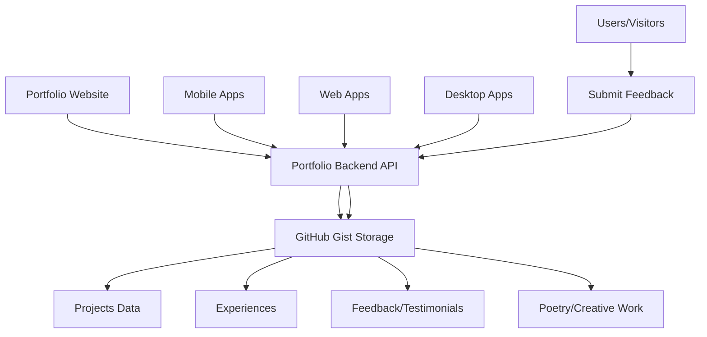

# Portfolio Backend API

> **A centralized backend service that connects all my projects to my portfolio, enabling feedback collection and serving as testimony for each application.**

## 👨‍💻 Creator

**Ryann Kim Sesgundo [MPOP Reverse II]**

## 🎯 Main Purpose

This repository serves as the **central nervous system** for my portfolio ecosystem. Its primary functions are:

- **🔗 Project Integration Hub**: Connects all my applications (web, mobile, desktop) to my portfolio
- **💬 Feedback Collection**: Gathers user feedback and testimonials for each project
- **📊 Portfolio Data Management**: Serves project information, experiences, and achievements
- **🌐 Unified API Gateway**: Provides consistent endpoints for all portfolio-related data

## 🏗️ What This Backend Powers

### Connected Applications & Projects

This backend serves data to and collects feedback from:

- **Portfolio Website** - Main showcase of projects and skills
- **Mobile Applications** - Various mobile projects in my portfolio
- **Web Applications** - Interactive web projects and demos
- **Desktop Applications** - Cross-platform desktop solutions

### Data Sources & Management

All data is managed through **GitHub Gist** as a lightweight, version-controlled database:

- **Projects Data** (`/projects`) - Showcase of all my applications
- **Experiences** (`/experiences`) - Professional and educational background
- **Feedback & Testimonials** (`/feedback`) - User reviews and project testimonials
- **Poetry & Creative Work** (`/poetry`) - Creative writing and artistic expressions
- **AI Agent Integration** - Smart responses and automated interactions

## 🚀 Live API Endpoints

| Endpoint | Method | Purpose | Description |
|----------|--------|---------|-------------|
| `/` | GET | Welcome | API health check and welcome message |
| `/projects` | GET | Projects Showcase | List of all portfolio projects with details |
| `/experiences` | GET | Professional Background | Work experience and education history |
| `/feedback` | GET | Testimonials | User feedback and project testimonials |
| `/feedback` | POST | Submit Feedback | Allow users to submit feedback for projects |
| `/poetry` | GET | Creative Work | Personal poetry and creative writing |
| `/ai-agent` | POST | AI Integration | Smart responses and automated interactions |

## 💡 How It Works



## 🛠️ Tech Stack

- **Backend**: Go 1.25+ with Gin Framework
- **Data Storage**: GitHub Gist API (JSON files)
- **Development**: Air (Hot reload)
- **Deployment**: Lightweight, containerizable
- **Authentication**: GitHub Personal Access Token

## 📁 Project Structure

```
portfolio-backend/
├── endpoints/              # API route handlers
│   ├── projects.go        # Projects showcase endpoint
│   ├── feedback.go        # Feedback retrieval
│   ├── post_feedback.go   # Feedback submission
│   ├── experiences.go     # Professional background
│   ├── poetry.go          # Creative work
│   ├── ai_agent.go        # AI integration
│   └── routers.go         # Route registration
├── middleware/            # Server setup and CORS
├── utils/                 # GitHub Gist integration & utilities
├── .env                   # Environment configuration
└── index.go              # Application entry point
```

## 🚀 Quick Start

### Prerequisites
- Go 1.25+
- GitHub Personal Access Token (with Gist permissions)

### Setup
1. **Clone the repository**
   ```bash
   git clone <repository-url>
   cd portfolio-backend
   ```

2. **Install dependencies**
   ```bash
   go mod download
   ```

3. **Configure environment**
   ```bash
   # Create .env file
   echo "API_KEY=your_github_personal_access_token" > .env
   ```

4. **Run the server**
   ```bash
   # Development (with hot reload)
   air
   
   # Or production
   go run index.go
   ```

The API will be available at `http://localhost:8000`

## 🔗 Integration Examples

### Frontend Integration
```javascript
// Fetch projects for portfolio display
const projects = await fetch('http://localhost:8000/projects')
  .then(res => res.json());

// Submit user feedback
await fetch('http://localhost:8000/feedback', {
  method: 'POST',
  headers: { 'Content-Type': 'application/json' },
  body: JSON.stringify({
    project: 'My Awesome App',
    rating: 5,
    comment: 'Great application!',
    user: 'John Doe'
  })
});
```

### Mobile App Integration
```dart
// Flutter/Dart example
Future<List<dynamic>> fetchProjects() async {
  final response = await http.get(
    Uri.parse('http://localhost:8000/projects')
  );
  return json.decode(response.body);
}
```

## 📊 Feedback & Testimonials System

This backend enables:
- **Real-time feedback collection** from any connected application
- **Testimonial management** for portfolio credibility
- **Project-specific reviews** to showcase user satisfaction
- **Automated feedback aggregation** for portfolio statistics

## 🌟 Why This Architecture?

1. **Centralized Management**: One API to rule them all
2. **Scalable**: Easy to add new projects and endpoints
3. **Lightweight**: GitHub Gist as database keeps it simple
4. **Version Controlled**: All data changes are tracked
5. **Cost Effective**: No database hosting costs
6. **Developer Friendly**: Simple JSON-based data management

## 🔒 Security & Configuration

- Environment-based API key management
- CORS enabled for cross-origin requests
- Input validation for all POST endpoints
- Rate limiting ready for production deployment

## 📈 Future Enhancements

- [ ] Analytics dashboard for feedback insights
- [ ] Real-time notifications for new feedback
- [ ] Advanced filtering and search capabilities
- [ ] Integration with more portfolio platforms
- [ ] Automated testimonial verification
- [ ] Multi-language support for global reach

## 📞 Contact & Feedback

**Ryann Kim Sesgundo**
- 📧 Email: weryses19@gmail.com
- 🔗 [GitHub](https://github.com/RyannKim327)
- 💼 [LinkedIn](https://www.linkedin.com/in/ryannkim327/)

---

⭐ **This backend is the foundation that makes my entire portfolio ecosystem possible!**

*Want to see it in action? Check out my portfolio website and other connected applications to see how this API powers the entire experience.*