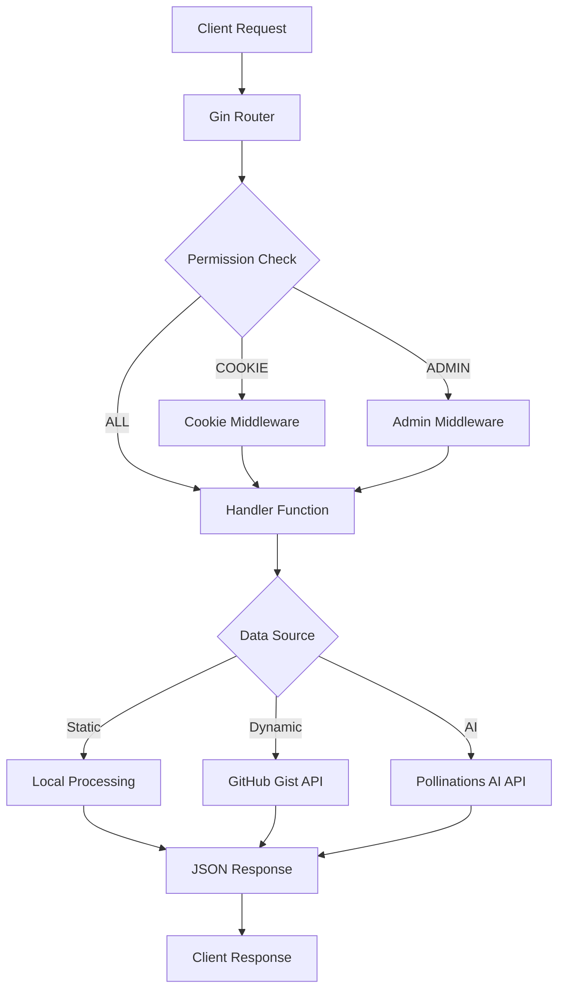
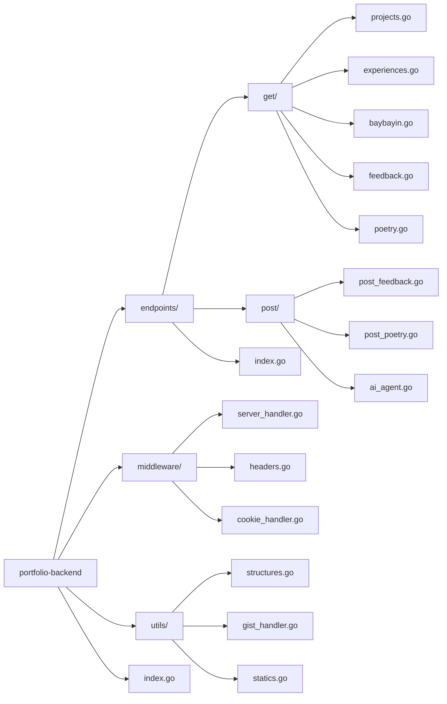
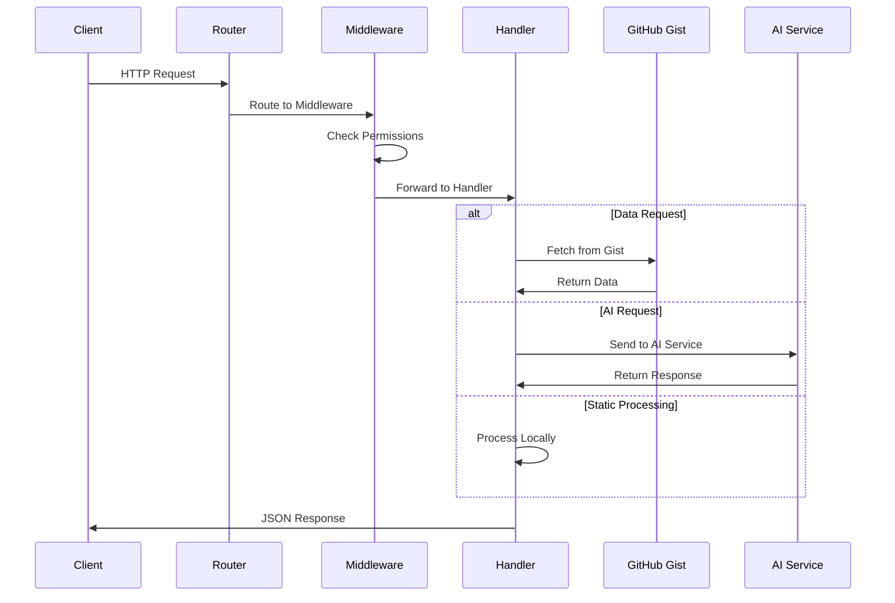

# Portfolio Backend

A comprehensive Go-based REST API backend designed to serve portfolio data through GitHub Gist integration. This backend provides endpoints for managing projects, experiences, feedback, and includes unique features like Baybayin transliteration and AI chat integration.

## 🚀 Features

- **RESTful API** with clean endpoint structure
- **GitHub Gist Integration** for dynamic data management
- **Baybayin Transliterator** for Filipino script conversion
- **AI Chat Agent** powered by Pollinations AI
- **Three-tier Permission System** (ALL, COOKIE, ADMIN)
- **CORS Support** with configurable origins
- **Hot Reload Development** with Air
- **Comprehensive Logging** with request tracking

## 📋 Table of Contents

- [Installation](#installation)
- [Configuration](#configuration)
- [API Endpoints](#api-endpoints)
- [Architecture](#architecture)
- [Development](#development)
- [Changelog](#changelog)
- [License](#license)

## 🛠 Installation

### Prerequisites

- Go 1.25.0 or higher
- Git
- GitHub Personal Access Token (for Gist integration)

### Setup

1. **Clone the repository**
   ```bash
   git clone https://github.com/RyannKim327/portfolio-backend.git
   cd portfolio-backend
   ```

2. **Install dependencies**
   ```bash
   go mod download
   ```

3. **Configure environment variables**
   ```bash
   cp .env.example .env
   # Edit .env with your configuration
   ```

4. **Run the application**
   ```bash
   # Development mode with hot reload
   air

   # Production mode
   go run index.go
   ```

## ⚙️ Configuration

Create a `.env` file in the root directory:

```env
APP_ENV=development
API_KEY=your_github_personal_access_token
GIST_ID=your_gist_id_for_data_storage
POST_API=your_post_api_key
PORT=8000
```

### Environment Variables

| Variable | Description | Required |
|----------|-------------|----------|
| `APP_ENV` | Application environment (development/production) | Yes |
| `API_KEY` | GitHub Personal Access Token for Gist API | Yes |
| `GIST_ID` | GitHub Gist ID for data storage | Yes |
| `POST_API` | API key for POST request validation | Yes |
| `PORT` | Server port (defaults to 8000) | No |

## 🌐 API Endpoints

### GET Endpoints

| Endpoint | Description | Parameters | Permission |
|----------|-------------|------------|------------|
| `/` | Server status check | None | ALL |
| `/projects` | Retrieve portfolio projects | None | ALL |
| `/experiences` | Get work experiences | None | ALL |
| `/feedback` | Retrieve feedback data | None | ALL |
| `/poetry` | Get poetry collection | None | ALL |
| `/baybayin` | Baybayin transliterator | `text` (query) | ALL |

### POST Endpoints

| Endpoint | Description | Body Parameters | Permission |
|----------|-------------|-----------------|------------|
| `/feedback/submit` | Submit feedback | `name`, `email`, `message` | COOKIE |
| `/poetry/submit` | Submit poetry | `title`, `content`, `author` | COOKIE |
| `/ai/chat/submit` | AI chat interaction | `messages` (array) | ALL |

### Baybayin Transliterator

**Endpoint:** `GET /baybayin`

Converts Filipino text to Baybayin script using Unicode characters.

**Example Request:**
```bash
curl "http://localhost:8000/baybayin?text=kumusta ka"
```

**Example Response:**
```json
{
  "original": "kumusta ka",
  "response": "ᜃᜓᜋᜓᜐ᜔ᜆ ᜃ"
}
```

### AI Chat Agent

**Endpoint:** `POST /ai/chat/submit`

Interact with an AI assistant powered by Pollinations AI.

**Example Request:**
```bash
curl -X POST http://localhost:8000/ai/chat/submit \
  -H "Content-Type: application/json" \
  -d '{
    "messages": [
      {
        "role": "user",
        "content": "Hello, how are you?"
      }
    ]
  }'
```

**Example Response:**
```json
{
  "role": "assistant",
  "content": "Hello! I'm doing well, thank you for asking. How can I help you today?"
}
```

## 🏗 Architecture

### System Architecture



### Project Structure



### Request Flow



## 🔧 Development

### Hot Reload Development

This project uses [Air](https://github.com/cosmtrek/air) for hot reload during development:

```bash
# Install Air (if not already installed)
go install github.com/cosmtrek/air@latest

# Start development server with hot reload
air
```

### Project Structure

```
portfolio-backend/
├── endpoints/           # API endpoint definitions
│   ├── get/            # GET request handlers
│   ├── post/           # POST request handlers
│   └── index.go        # Route registration
├── middleware/         # HTTP middleware
│   ├── server_handler.go
│   ├── headers.go
│   ├── cookie_handler.go
│   └── post_request.go
├── utils/              # Utility functions
│   ├── structures.go   # Data structures
│   ├── gist_handler.go # GitHub Gist integration
│   ├── statics.go      # Constants
│   └── tools.go        # Helper functions
├── tmp/                # Temporary files (Air)
├── .air.toml          # Air configuration
├── .env               # Environment variables
├── go.mod             # Go module definition
└── index.go           # Application entry point
```

### Adding New Endpoints

1. **Create endpoint file** in `endpoints/get/` or `endpoints/post/`
2. **Define route structure** using `utils.Route`
3. **Register route** in `endpoints/index.go`
4. **Implement handler function**

Example:
```go
// endpoints/get/example.go
package get

import (
    "portfolio-backend/utils"
    "github.com/gin-gonic/gin"
)

var Example = utils.Route{
    Path:   "/example",
    Method: utils.METHOD_GET,
    Handler: func(ctx *gin.Context) {
        ctx.JSON(200, gin.H{
            "message": "Hello World",
        })
    },
}
```

### Permission System

The application supports three permission levels:

- **`PERMISSION_ALL`**: Open access, no authentication required
- **`PERMISSION_COOKIE`**: Requires valid cookie authentication
- **`PERMISSION_ADMIN`**: Requires admin-level authentication

## 📝 Changelog

### Version 1.2.0 - January 19, 2026

#### Added
- Enhanced AI chat agent with improved response formatting
- Better error handling for API requests
- Comprehensive logging system with timestamp formatting

#### Fixed
- Baybayin transliterator character mapping improvements
- CORS configuration for production deployment
- Cookie handling middleware stability

#### Changed
- Updated Go version to 1.25.0
- Improved project structure documentation
- Enhanced middleware permission system

### Version 1.1.0 - January 3, 2026

#### Added
- Three-tier permission system (ALL, COOKIE, ADMIN)
- Cookie handler middleware for secure authentication
- Admin-level endpoint protection
- Enhanced request logging and monitoring

#### Fixed
- Security improvements for POST endpoints
- Better error handling for unauthorized requests

#### Changed
- Restructured middleware architecture
- Improved endpoint registration system

### Version 1.0.0 - January 1, 2026

#### Added
- Baybayin transliterator endpoint with Unicode support
- AI chat agent integration with Pollinations AI
- Complete Filipino script character mapping
- Text normalization for accurate transliteration

#### Fixed
- Baybayin character encoding issues
- String processing for special characters
- Transliteration accuracy improvements

#### Changed
- Enhanced API response formatting
- Improved error messages for better debugging

### Version 0.9.0 - December 31, 2025

#### Added
- Initial Baybayin transliterator implementation
- Basic character mapping system
- Text processing utilities

#### Fixed
- Initial transliteration algorithm
- Character recognition patterns

### Version 0.8.0 - December 30, 2025

#### Added
- Core API structure with Gin framework
- GitHub Gist integration for data management
- Basic CORS configuration
- Environment variable support

#### Features
- RESTful API endpoints for portfolio data
- Dynamic data fetching from GitHub Gist
- Hot reload development setup with Air
- Comprehensive error handling

## 🤝 Contributing

1. Fork the repository
2. Create a feature branch (`git checkout -b feature/amazing-feature`)
3. Commit your changes (`git commit -m 'Add some amazing feature'`)
4. Push to the branch (`git push origin feature/amazing-feature`)
5. Open a Pull Request

## 📄 License

This project is licensed under the MIT License - see the [LICENSE.md](LICENSE.md) file for details.

### Additional Terms

- **Attribution**: Attribution to the original author (Ryann Kim Sesgundo) is appreciated but not required
- **GitHub Integration**: Users are responsible for complying with GitHub's Terms of Service and API usage policies
- **Data Privacy**: Users must ensure compliance with applicable data protection regulations
- **Security**: Implement appropriate security measures before deploying to production

## 👨‍💻 Author

**Ryann Kim Sesgundo (MPOP Reverse II)**
- Email: weryses19@gmail.com
- GitHub: [@RyannKim327](https://github.com/RyannKim327)
- Portfolio: [ryannkim327.is-a.dev](https://ryannkim327.is-a.dev)

## 🙏 Acknowledgments

- [Gin Web Framework](https://gin-gonic.com/) for the excellent HTTP framework
- [Air](https://github.com/cosmtrek/air) for hot reload development
- [Pollinations AI](https://pollinations.ai/) for AI chat integration
- GitHub Gist API for data storage solution

---

**Note**: This backend is designed as a centralized hub for managing deployed projects across web and mobile platforms. The API is optimized for portfolio websites and applications requiring dynamic content management.