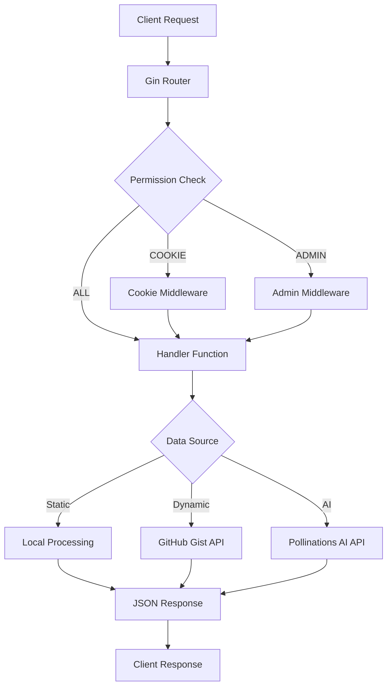
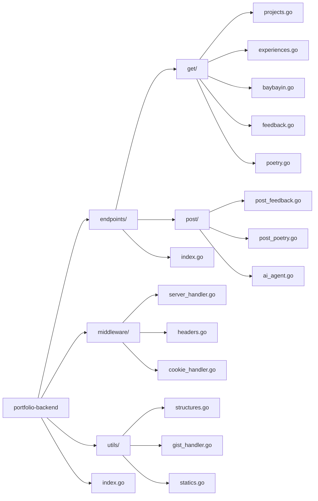
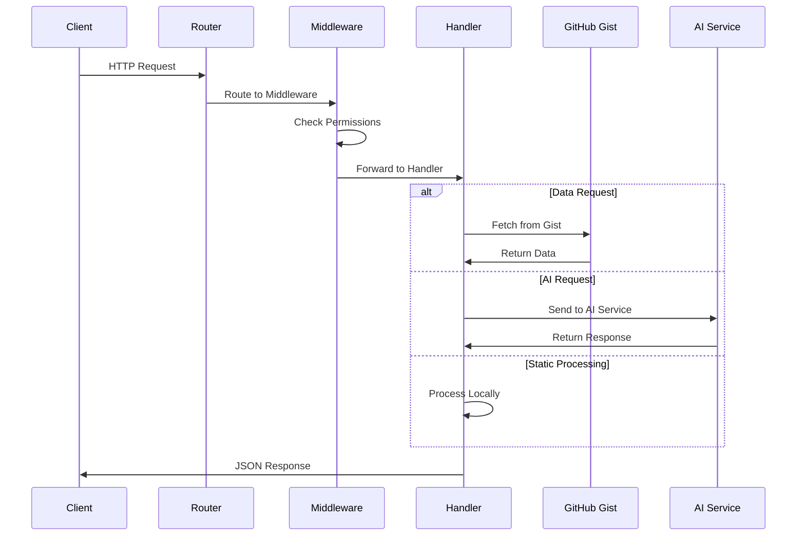

# Portfolio Backend

A comprehensive Go-based REST API backend designed to serve portfolio data through GitHub Gist integration. This backend provides endpoints for managing projects, experiences, feedback, and includes unique features like Baybayin transliteration and AI chat integration.

## 🚀 Features

- **RESTful API** with clean endpoint structure
- **GitHub Gist Integration** for dynamic data management
- **Baybayin Transliterator** for Filipino script conversion
- **AI Chat Agent** powered by Pollinations AI
- **Three-tier Permission System** (ALL, COOKIE, ADMIN)
- **CORS Support** with configurable origins
- **Hot Reload Development** with Air
- **Comprehensive Logging** with request tracking
- **Environment-based Configuration** for development and production
- **Modular Architecture** with clean separation of concerns
- **Unicode Support** for Baybayin script rendering
- **Caching System** for improved performance

## 📋 Table of Contents

- [Installation](#installation)
- [Configuration](#configuration)
- [API Endpoints](#api-endpoints)
- [Architecture](#architecture)
- [Development](#development)
- [Testing](#testing)
- [Deployment](#deployment)
- [Troubleshooting](#troubleshooting)
- [Changelog](#changelog)
- [Contributing](#contributing)
- [License](#license)

## 🛠 Installation

### Prerequisites

- Go 1.25.0 or higher
- Git
- GitHub Personal Access Token (for Gist integration)
- [Air](https://github.com/cosmtrek/air) for hot reload development (optional but recommended)

### Setup

1. **Clone the repository**
   ```bash
   git clone https://github.com/RyannKim327/portfolio-backend.git
   cd portfolio-backend
   ```

2. **Install dependencies**
   ```bash
   go mod download
   ```

3. **Configure environment variables**
   
   Create a `.env` file in the root directory with the following variables:
   ```bash
   # Copy and modify these values according to your setup
   APP_ENV=development
   API_KEY=your_github_personal_access_token
   GIST_ID=your_gist_id_for_data_storage
   POST_API=your_post_api_key
   TG_API=your_telegram_bot_token
   TG_CHATID=your_telegram_chat_or_channel_id
   PORT=8000
   ```

4. **Run the application**
   ```bash
   # Development mode with hot reload
   air

   # Production mode
   go run index.go
   ```

## ⚙️ Configuration

Create a `.env` file in the root directory:

```env
APP_ENV=development
API_KEY=your_github_personal_access_token
GIST_ID=your_gist_id_for_data_storage
POST_API=your_post_api_key
TG_API=your_telegram_bot_token
TG_CHATID=your_telegram_chat_or_channel_id
PORT=8000
```

### Environment Variables

| Variable | Description | Required |
|----------|-------------|----------|
| `APP_ENV` | Application environment (development/production) | Yes |
| `API_KEY` | GitHub Personal Access Token for Gist API | Yes |
| `GIST_ID` | GitHub Gist ID for data storage | Yes |
| `POST_API` | API key read by `X-API-Key` header for admin-only POST requests | Yes |
| `TG_API` | Telegram bot token used for `/images` proxying and `/upload` relays | Yes |
| `TG_CHATID` | Telegram chat/channel ID that receives uploaded media | Yes (for uploads) |
| `PORT` | Server port (defaults to 8000 if unset) | No |

## 🌐 API Endpoints

### GET Endpoints

| Endpoint | Description | Required Parameters | Optional Parameters | Permission |
|----------|-------------|---------------------|---------------------|------------|
| `/` | Server status check | None | None | ALL |
| `/projects` | Retrieve portfolio projects | None | None | ALL |
| `/experiences` | Get work experiences | None | None | ALL |
| `/blog` | Retrieve latest blog entries from Gist | None | None | ALL |
| `/feedback` | Retrieve paginated feedback entries | None | `page` (integer ≥ 1, defaults to 1, 10 entries per page) | ALL |
| `/poetry` | Get poetry collection | None | None | ALL |
| `/baybayin` | Baybayin transliterator | `text` (query) | None | ALL |
| `/images` | Proxy Telegram-hosted images | `file` (Telegram `file_id`) | None | ALL |
| `/manga` | Manga search/reader utility | Either `s` (search query) or `r` (series slug) | `c` (chapter slug when reading) | ALL |
| `/set-cookie` | Set authentication cookie | None | None | ALL |

### POST Endpoints

| Endpoint | Description | Body/Input | Permission |
|----------|-------------|-----------|------------|
| `/feedback/submit` | Submit feedback stored in Gist | JSON object with `name`, `email`, `message` | COOKIE (requires `temporary` cookie) |
| `/poetry/submit` | Submit poetry entry | JSON object with `title`, `content`, `author` | ADMIN (`X-API-Key` header must equal `POST_API`) |
| `/ai/chat` | AI chat interaction powered by Pollinations | JSON object `{ "messages": [{ "role": "user\|assistant", "content": "..." }] }` | ALL |
| `/upload/submit` | Upload image/document via Telegram bot | `multipart/form-data` with `image` file field | ADMIN (`X-API-Key` + Telegram env vars) |

#### GET /feedback

Pagination is controlled with the `page` query parameter (defaults to `1`). Each page returns up to 10 entries pulled from `feedback.json` in GitHub Gist. Results are cached for 5 minutes; requesting page 1 is the safest way to invalidate stale data quickly.

#### GET /blog

Returns the complete list of blog entries stored in `blog.json` inside the GitHub Gist. The endpoint currently streams the whole dataset (no pagination) and always responds with the newest entry first because results are reversed before returning.

```bash
curl "http://localhost:8000/blog"
```

**Sample Response**
```json
{
  "data": [
    {
      "title": "Building an API",
      "tags": ["go", "gin"],
      "excerpt": "..."
    }
  ]
}
```

#### GET /baybayin

Converts Filipino text to Baybayin script using Unicode characters.

**Example Request:**
```bash
curl "http://localhost:8000/baybayin?text=kumusta ka"
```

**Example Response:**
```json
{
  "original": "kumusta ka",
  "response": "ᜃᜓᜋᜓᜐ᜔ᜆ ᜃ"
}
```

#### GET /manga

`GET /manga` works in three modes:

1. **Search** – provide `s` to search by title.
   ```bash
   curl "http://localhost:8000/manga?s=one+piece"
   ```
2. **List chapters** – provide `r` with the manga slug to enumerate available chapters.
   ```bash
   curl "http://localhost:8000/manga?r=one-piece"
   ```
3. **Read a chapter** – provide both `r` (slug) and `c` (chapter identifier) to receive an array of page image URLs.
   ```bash
   curl "http://localhost:8000/manga?r=one-piece&c=chapter-1101"
   ```

#### GET /images

Fetches Telegram-hosted files using the `file` query parameter (Telegram `file_id`). The endpoint proxies the binary content so it can be displayed directly in browsers without exposing Telegram credentials.

```bash
curl "http://localhost:8000/images?file=AgACAgUAAxkBAAIBQWdow"
```

#### POST /ai/chat

Interact with an AI assistant powered by Pollinations AI.

**Example Request:**
```bash
curl -X POST http://localhost:8000/ai/chat \\
  -H "Content-Type: application/json" \\
  -d '{
    "messages": [
      {
        "role": "user",
        "content": "Hello, how are you?"
      }
    ]
  }'
```

**Example Response:**
```json
{
  "role": "assistant",
  "content": "Hello! I'm doing well, thank you for asking. How can I help you today?"
}
```

#### POST /upload/submit

Allows administrators to upload images/documents that will be relayed to the configured Telegram chat. Use `multipart/form-data`, provide the `image` field, and include the `X-API-Key` header that matches `POST_API`:

```bash
curl -X POST http://localhost:8000/upload/submit \\
  -H "X-API-Key: $POST_API" \\
  -F "image=@/path/to/photo.jpg"
```

The API responds with the raw Telegram response payload, including the resulting `file_id` that can be used with `GET /images`.

## 🏗 Architecture

### System Architecture


```mermaid
flowchart TD
    A[Client Request] --> B[Gin Router]
    B --> C{Permission Check}
    C -->|ALL| D[Handler Function]
    C -->|COOKIE| E[Cookie Middleware]
    C -->|ADMIN| F[Admin Middleware]
    E --> D
    F --> D
    D --> G{Data Source}
    G -->|Static| H[Local Processing]
    G -->|Dynamic| I[GitHub Gist API]
    G -->|AI| J[Pollinations AI API]
    H --> K[JSON Response]
    I --> K
    J --> K
    K --> L[Client Response]
```

### Project Structure


```mermaid
flowchart LR
    A[portfolio-backend] --> B[endpoints/]
    A --> C[middleware/]
    A --> D[utils/]
    A --> E[index.go]
    
    B --> F[get/]
    B --> G[post/]
    B --> H[index.go]
    
    F --> I[projects.go]
    F --> J[experiences.go]
    F --> K[baybayin.go]
    F --> L[feedback.go]
    F --> M[poetry.go]
    
    G --> N[post_feedback.go]
    G --> O[post_poetry.go]
    G --> P[ai_agent.go]
    
    C --> Q[server_handler.go]
    C --> R[headers.go]
    C --> S[cookie_handler.go]
    
    D --> T[structures.go]
    D --> U[gist_handler.go]
    D --> V[statics.go]
```

### Request Flow


```mermaid
sequenceDiagram
    participant C as Client
    participant R as Router
    participant M as Middleware
    participant H as Handler
    participant G as GitHub Gist
    participant AI as AI Service

    C->>R: HTTP Request
    R->>M: Route to Middleware
    M->>M: Check Permissions
    M->>H: Forward to Handler
    
    alt Data Request
        H->>G: Fetch from Gist
        G->>H: Return Data
    else AI Request
        H->>AI: Send to AI Service
        AI->>H: Return Response
    else Static Processing
        H->>H: Process Locally
    end
    
    H->>C: JSON Response
```

## 🔧 Development

### Hot Reload Development

This project uses [Air](https://github.com/cosmtrek/air) for hot reload during development:

```bash
# Install Air (if not already installed)
go install github.com/cosmtrek/air@latest

# Start development server with hot reload
air

# The server will automatically restart when you make changes to .go files
# Build logs are saved to build-errors.log
# Temporary files are stored in the tmp/ directory
```

### Building for Production

```bash
# Build the application
go build -o portfolio-backend .

# Run the built binary
./portfolio-backend

# Or build and run in one command
go run index.go
```

### Project Structure

```
portfolio-backend/
├── endpoints/           # API endpoint definitions
│   ├── get/            # GET request handlers
│   ├── post/           # POST request handlers
│   └── index.go        # Route registration
├── middleware/         # HTTP middleware
│   ├── server_handler.go
│   ├── headers.go
│   ├── cookie_handler.go
│   └── post_request.go
├── utils/              # Utility functions
│   ├── structures.go   # Data structures
│   ├── gist_handler.go # GitHub Gist integration
│   ├── gist.go         # Additional Gist utilities
│   ├── statics.go      # Constants
│   └── tools.go        # Helper functions
├── tmp/                # Temporary files (Air)
├── .air.toml          # Air configuration
├── .env               # Environment variables
├── go.mod             # Go module definition
└── index.go           # Application entry point
```

### Adding New Endpoints

1. **Create endpoint file** in `endpoints/get/` or `endpoints/post/`
2. **Define route structure** using `utils.Route`
3. **Register route** in `endpoints/index.go`
4. **Implement handler function**

Example:
```go
// endpoints/get/example.go
package get

import (
    "portfolio-backend/utils"
    "github.com/gin-gonic/gin"
)

var Example = utils.Route{
    Path:       "/example",
    Method:     utils.METHOD_GET,
    Permission: utils.PERMISSION_ALL, // or PERMISSION_COOKIE, PERMISSION_ADMIN
    Handler: func(ctx *gin.Context) {
        ctx.JSON(200, gin.H{
            "message": "Hello World",
        })
    },
}
```

Then add it to `endpoints/index.go`:
```go
var Routes = []utils.Route{
    // ... existing routes
    get.Example, // Add your new route here
}
```

### Permission System

The application supports three permission levels:

- **`PERMISSION_ALL`**: Open access, no authentication required
- **`PERMISSION_COOKIE`**: Requires valid cookie authentication
- **`PERMISSION_ADMIN`**: Requires admin-level authentication

## 🧪 Testing

### Manual Testing

You can test the API endpoints using curl or any HTTP client:

```bash
# Test server status
curl http://localhost:8000/

# Test Baybayin transliterator
curl "http://localhost:8000/baybayin?text=kumusta ka"

# Test AI chat (POST request)
curl -X POST http://localhost:8000/ai/chat \
  -H "Content-Type: application/json" \
  -d '{"messages":[{"role":"user","content":"Hello!"}]}'

# Test feedback submission (requires cookie)
curl -X POST http://localhost:8000/feedback/submit \
  -H "Content-Type: application/json" \
  -H "Cookie: your-auth-cookie" \
  -d '{"name":"Test","email":"test@example.com","message":"Test message"}'
```

### Environment Testing

```bash
# Test with different environments
APP_ENV=production go run index.go
APP_ENV=development go run index.go
```

## 🚀 Deployment

### Production Deployment

1. **Build the application**
   ```bash
   go build -o portfolio-backend .
   ```

2. **Set production environment variables**
   ```bash
   export APP_ENV=production
   export API_KEY=your_production_github_token
   export GIST_ID=your_production_gist_id
   export POST_API=your_production_post_api_key
   export TG_API=your_production_telegram_bot_token
   export TG_CHATID=your_production_telegram_chat_id
   export PORT=8000
   ```

3. **Run the application**
   ```bash
   ./portfolio-backend
   ```

### Docker Deployment (Optional)

Create a `Dockerfile`:
```dockerfile
FROM golang:1.25-alpine AS builder
WORKDIR /app
COPY go.mod go.sum ./
RUN go mod download
COPY . .
RUN go build -o portfolio-backend .

FROM alpine:latest
RUN apk --no-cache add ca-certificates
WORKDIR /root/
COPY --from=builder /app/portfolio-backend .
EXPOSE 8000
CMD ["./portfolio-backend"]
```

### Environment Variables for Production

- Set `APP_ENV=production` for production optimizations
- Use secure API keys and tokens
- Configure appropriate CORS origins
- Set up proper logging and monitoring

## 🔧 Troubleshooting

### Common Issues

#### Port Already in Use
```bash
# Check what's using port 8000
lsof -i :8000

# Kill the process or change PORT in .env
export PORT=8080
```

#### GitHub API Rate Limiting
- Ensure your GitHub Personal Access Token has proper permissions
- Check rate limits: `curl -H "Authorization: token YOUR_TOKEN" https://api.github.com/rate_limit`

#### CORS Issues
- Check your CORS configuration in the middleware
- Ensure your frontend origin is allowed

#### Gist Access Issues
- Verify your `GIST_ID` is correct
- Ensure your GitHub token has gist permissions
- Check if the gist is public or private

#### Build Errors
```bash
# Clean module cache
go clean -modcache

# Reinstall dependencies
go mod download

# Verify Go version
go version
```

### Debug Mode

Enable debug logging by setting:
```bash
export APP_ENV=development
```

### Logs

- Air build logs: `build-errors.log`
- Application logs: Check console output
- Request logs: Enabled by default in development mode

## 📝 Changelog

### Version 1.3.1 - February 12, 2026

Updates gathered from commit `5ae36f8`.

#### Added
- **Public blog endpoint** (`GET /blog`) re-registered so it is part of the router again and exposed through the API matrix.

#### Changed
- Simplified `GET /blog` handler to always return the full reversed list from `blog.json`, temporarily disabling the unfinished pagination cache to avoid stale data.
- Re-enabled localhost (`http://localhost:5173`) as an allowed origin in the CORS middleware to unblock local frontend testing sessions.

### Version 1.3.0 - February 7, 2026

Updates gathered from commits `231d625`, `886400b`, and `79880e1`.

#### Added
- **Manga utility endpoint** (`GET /manga`) that supports search, chapter listing, and inline chapter reading workflows.
- **Telegram storage bridge** with `POST /upload/submit` for administrators and `GET /images` for public consumption, enabling offloaded asset hosting.
- **Expanded README endpoint matrix** covering required query/body parameters and usage examples for new routes.

#### Changed
- Documented the new pagination behaviour for `GET /feedback` and aligned API docs with the latest permission matrix.
- Clarified AI chat usage to match the updated `/ai/chat` path and payload structure.

### Version 1.2.0 - January 19, 2026

#### Added
- Enhanced AI chat agent with improved response formatting
- Better error handling for API requests
- Comprehensive logging system with timestamp formatting

#### Fixed
- Baybayin transliterator character mapping improvements
- CORS configuration for production deployment
- Cookie handling middleware stability

#### Changed
- Updated Go version to 1.25.0
- Improved project structure documentation
- Enhanced middleware permission system

### Version 1.1.0 - January 3, 2026

#### Added
- Three-tier permission system (ALL, COOKIE, ADMIN)
- Cookie handler middleware for secure authentication
- Admin-level endpoint protection
- Enhanced request logging and monitoring

#### Fixed
- Security improvements for POST endpoints
- Better error handling for unauthorized requests

#### Changed
- Restructured middleware architecture
- Improved endpoint registration system

### Version 1.0.0 - January 1, 2026

#### Added
- Baybayin transliterator endpoint with Unicode support
- AI chat agent integration with Pollinations AI
- Complete Filipino script character mapping
- Text normalization for accurate transliteration

#### Fixed
- Baybayin character encoding issues
- String processing for special characters
- Transliteration accuracy improvements

#### Changed
- Enhanced API response formatting
- Improved error messages for better debugging

### Version 0.9.0 - December 31, 2025

#### Added
- Initial Baybayin transliterator implementation
- Basic character mapping system
- Text processing utilities

#### Fixed
- Initial transliteration algorithm
- Character recognition patterns

### Version 0.8.0 - December 30, 2025

#### Added
- Core API structure with Gin framework
- GitHub Gist integration for data management
- Basic CORS configuration
- Environment variable support

#### Features
- RESTful API endpoints for portfolio data
- Dynamic data fetching from GitHub Gist
- Hot reload development setup with Air
- Comprehensive error handling

## 🤝 Contributing

1. Fork the repository
2. Create a feature branch (`git checkout -b feature/amazing-feature`)
3. Commit your changes (`git commit -m 'Add some amazing feature'`)
4. Push to the branch (`git push origin feature/amazing-feature`)
5. Open a Pull Request

## 📄 License

This project is licensed under the MIT License - see the [LICENSE.md](LICENSE.md) file for details.

### Additional Terms

- **Attribution**: Attribution to the original author (Ryann Kim Sesgundo) is appreciated but not required
- **GitHub Integration**: Users are responsible for complying with GitHub's Terms of Service and API usage policies
- **Data Privacy**: Users must ensure compliance with applicable data protection regulations
- **Security**: Implement appropriate security measures before deploying to production

## 👨‍💻 Author

**Ryann Kim Sesgundo (MPOP Reverse II)**
- Email: weryses19@gmail.com
- GitHub: [@RyannKim327](https://github.com/RyannKim327)
- Portfolio: [ryannkim327.is-a.dev](https://ryannkim327.is-a.dev)

## 🙏 Acknowledgments

- [Gin Web Framework](https://gin-gonic.com/) for the excellent HTTP framework
- [Air](https://github.com/cosmtrek/air) for hot reload development
- [Pollinations AI](https://pollinations.ai/) for AI chat integration
- [GitHub Gist API](https://docs.github.com/en/rest/gists) for data storage solution
- [GoDotEnv](https://github.com/joho/godotenv) for environment variable management
- [Gin CORS](https://github.com/gin-contrib/cors) for Cross-Origin Resource Sharing support

---

**Note**: This backend is designed as a centralized hub for managing deployed projects across web and mobile platforms. The API is optimized for portfolio websites and applications requiring dynamic content management.
