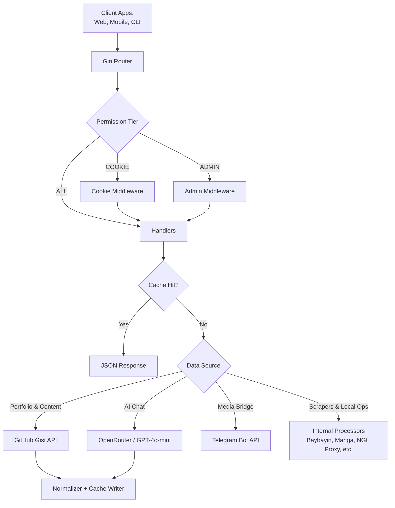
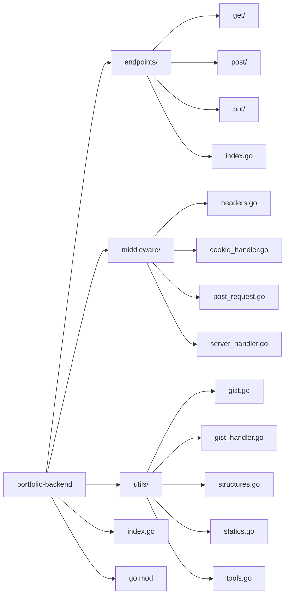
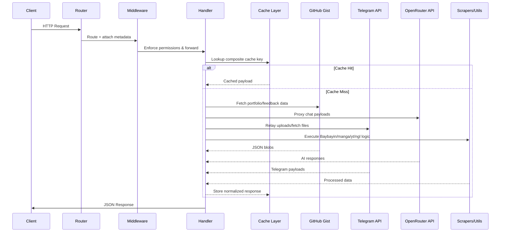

# Portfolio Backend

A comprehensive Go-based REST API backend designed to serve portfolio data through GitHub Gist integration. This backend provides endpoints for managing projects, experiences, feedback, and includes unique features like Baybayin transliteration and AI chat integration.

<div align="center">


[](https://wakatime.com/badge/github/RyannKim327/portfolio-backend)

</div>

## 🚀 Features

- **RESTful API** with clean endpoint structure
- **GitHub Gist Integration** for dynamic data management
- **Baybayin Transliterator** for Filipino script conversion
- **AI Chat Agent** powered by GPT-4o-mini via OpenRouter
- **NGL Proxy Integration** for anonymous messaging relay
- **Three-tier Permission System** (ALL, COOKIE, ADMIN)
- **CORS Support** with configurable origins
- **Hot Reload Development** with Air
- **Comprehensive Logging** with request tracking
- **Environment-based Configuration** for development and production
- **Modular Architecture** with clean separation of concerns
- **Unicode Support** for Baybayin script rendering
- **Caching System** for improved performance
- **Resume Data Delivery** via dedicated dev endpoint

## 📋 Table of Contents

- [Installation](#installation)
- [Configuration](#configuration)
- [API Endpoints](#-api-endpoints)
- [Documentation](#-documentation)
- [System Architecture](#-system-architecture)
- [Development](#development)
- [Testing](#testing)
- [Deployment](#deployment)
- [Troubleshooting](#troubleshooting)
- [Changelog](#changelog)
- [Contributing](#contributing)
- [License](#license)

## 🛠 Installation

### Prerequisites

- Go 1.25.3 or higher
- Git
- GitHub Personal Access Token (for Gist integration)
- OpenRouter API Key (for AI chat integration)
- [Air](https://github.com/cosmtrek/air) for hot reload development (optional but recommended)

### Setup

1. **Clone the repository**

   ```bash
   git clone https://github.com/RyannKim327/portfolio-backend.git
   cd portfolio-backend
   ```

2. **Install dependencies**

   ```bash
   go mod download
   ```

3. **Configure environment variables**

   Create a `.env` file in the root directory with the following variables:

   ```bash
   # Copy and modify these values according to your setup
   APP_ENV=development
   API_KEY=your_github_personal_access_token
   GIST_ID=your_gist_id_for_data_storage
   POST_API=your_post_api_key
   TG_API=your_telegram_bot_token
   TG_CHATID=your_telegram_chat_or_channel_id
   RAPIDKEY=your_rapidapi_key
   RAPIDHOST=youtube-mp36.p.rapidapi.com
   AI_API=your_openrouter_api_key
   PORT=8000
   ```

4. **Run the application**

   ```bash
   # Development mode with hot reload
   air

   # Production mode
   go run index.go
   ```

## ⚙️ Configuration

Create a `.env` file in the root directory:

```env
APP_ENV=development
API_KEY=your_github_personal_access_token
GIST_ID=your_gist_id_for_data_storage
POST_API=your_post_api_key
TG_API=your_telegram_bot_token
TG_CHATID=your_telegram_chat_or_channel_id
RAPIDKEY=your_rapidapi_key
RAPIDHOST=youtube-mp36.p.rapidapi.com
AI_API=your_openrouter_api_key
PORT=8000
```

### Environment Variables

| Variable    | Description                                                         | Required                 |
| ----------- | ------------------------------------------------------------------- | ------------------------ |
| `APP_ENV`   | Application environment (development/production)                    | Yes                      |
| `API_KEY`   | GitHub Personal Access Token for Gist API                           | Yes                      |
| `GIST_ID`   | GitHub Gist ID for data storage                                     | Yes                      |
| `POST_API`  | API key read by `X-API-Key` header for admin-only POST requests     | Yes                      |
| `TG_API`    | Telegram bot token used for `/images` proxying and `/upload` relays | Yes (for images/uploads) |
| `TG_CHATID` | Telegram chat/channel ID that receives uploaded media               | Yes (for uploads)        |
| `RAPIDKEY`  | RapidAPI key used by `/yt`                                          | Yes (for `/yt`)          |
| `RAPIDHOST` | RapidAPI host used by `/yt` (e.g. `youtube-mp36.p.rapidapi.com`)    | Yes (for `/yt`)          |
| `AI_API`    | OpenRouter API key used for `/ai/chat`                              | Yes (for `/ai/chat`)     |
| `PORT`      | Server port (defaults to 8000 if unset)                             | No                       |

## 🌐 API Endpoints

### Endpoint Matrix

| Method | Path           | Permission | Description                   | Notes                                                               |
| ------ | -------------- | ---------- | ----------------------------- | ------------------------------------------------------------------- |
| GET    | `/`            | ALL        | Health/status probe           | Returns application metadata and uptime markers.                    |
| GET    | `/projects`    | ALL        | Portfolio project listing     | Reads from GitHub Gist; cached for 5m.                              |
| GET    | `/experiences` | ALL        | Work experience timeline      | Sorted chronologically before response.                             |
| GET    | `/certs`       | ALL        | Certificates listing          | Reads `certificates.json` from GitHub Gist; reversed newest-first.  |
| GET    | `/blog`        | ALL        | Blog feed                     | Streams entire `blog.json`, newest-first.                           |
| GET    | `/feedback`    | ALL        | Public feedback viewer        | Supports pagination via `page` query.                               |
| GET    | `/poetry`      | ALL        | Poetry collection             | Mirrors the curated poetry list from Gist.                          |
| GET    | `/baybayin`    | ALL        | Baybayin transliterator       | Requires `text` query; returns Unicode script.                      |
| GET    | `/retrieve`    | ALL        | Telegram CDN proxy            | Requires `file` (Telegram `file_id`). Proxies via Telegram Bot API. |
| GET    | `/manga`       | ALL        | Manga helper utility          | Use `s` for search, `r` for series, `c` for chapter.                |
| GET    | `/set-cookie`  | ALL        | Issues temporary cookie       | Sets `temporary` cookie (30m) for cookie-protected access.          |
| GET    | `/yt`          | ALL        | YouTube MP3 downloader helper | Requires `videoID` query. Uses RapidAPI.                            |
| GET    | `/dev`         | ALL        | Resume/Dev data retrieval     | Retrieves `resume.json` from GitHub Gist.                           |
| GET    | `/contact`     | ADMIN      | Contact message list          | Admin-only view of received messages.                               |
| POST   | `/feedback`    | COOKIE     | Stores feedback via Gist      | Requires `temporary` cookie + JSON body.                            |
| POST   | `/contact`     | COOKIE     | Submits contact message       | Requires `temporary` cookie.                                        |
| POST   | `/poetry`      | ADMIN      | Publishes new poem entries    | Requires `X-API-Key` header (matches `POST_API`).                   |
| POST   | `/ai/chat`     | ALL        | GPT-4o-mini chat relay        | Accepts ChatGPT-style `messages` array via OpenRouter.              |
| POST   | `/ngl`         | ALL        | NGL message proxy             | Proxies anonymous messages to NGL.link.                             |
| POST   | `/blog`        | ADMIN      | Creates new blog post         | Requires `X-API-Key` header. Auto-assigns ID.                       |
| POST   | `/certs`       | ADMIN      | Append a certificate entry    | Requires `X-API-Key` header.                                        |
| POST   | `/upload`      | ADMIN      | Telegram upload bridge        | `multipart/form-data` with `image` field.                           |
| PUT    | `/blog`        | ADMIN      | Updates existing blog post    | Requires `X-API-Key` header and post `id`.                          |
| PUT    | `/experiences` | ADMIN      | Updates experience data       | Requires `X-API-Key` header. Overwrites entire list.                |

### Endpoint Details

#### GET /feedback

- **Pagination**: `page` query (≥ 1, default `1`).
- **Cache**: Responses cached for 5 minutes; requesting page `1` invalidates the cache first.
- **Storage**: Reads `feedback.json` from the configured GitHub Gist.

```bash
curl "http://localhost:8000/feedback?page=2"
```

#### GET /blog

- **Pagination**: `page` query (≥ 1, default `1`). Response includes `pages`, `current`, `count`, and `data`.
- **Cache**: Responses cached for 5 minutes and refreshed in the background when cache is valid.
- **Ordering**: Newest entries appear first by reversing the list in-memory.

```bash
curl "http://localhost:8000/blog?page=1"
```

#### GET /baybayin

- **Usage**: Converts Latin text to Baybayin script using Unicode glyphs and normalization.
- **Tip**: Strip punctuation on the client side for best transliteration accuracy.

```bash
curl "http://localhost:8000/baybayin?text=kumusta%20ka"
```

#### GET /manga

`GET /manga` is a multi-mode scraper around a third-party manga source:

1. **Search** – `?s=<title>` to get matching series metadata.
2. **Chapter List** – `?r=<series-slug>` to enumerate chapters.
3. **Chapter Pages** – `?r=<series-slug>&c=<chapter-id>` to receive page image URLs.

#### GET /retrieve

- **Input**: `file` query takes a Telegram `file_id` returned by `POST /upload`.
- **Behaviour**: The backend downloads the file via Telegram Bot API and streams it to the caller, masking bot credentials.

```bash
curl "http://localhost:8000/retrieve?file=AgACAgUAAxkBAAIBQWdow"
```

#### POST /ai/chat

- **Body**: Chat-style payload with `messages` array.
- **Model**: Uses `openai/gpt-4o-mini` via OpenRouter.
- **Headers**: Requires `AI_API` environment variable for authorization.

```bash
curl -X POST http://localhost:8000/ai/chat \\
  -H "Content-Type: application/json" \\
  -d '{
    "messages": [
      {"role": "user", "content": "Hello, how are you?"}
    ]
  }'
```

#### POST /ngl

- **Body**: JSON payload with `username` and `question`.
- **Behavior**: Proxies the submission to NGL.link API.

```bash
curl -X POST http://localhost:8000/ngl \\
  -H "Content-Type: application/json" \\
  -d '{
    "username": "example_user",
    "question": "Ask me anything!"
  }'
```

#### POST /upload

- **Security**: Requires both `X-API-Key` header (`POST_API`) and valid Telegram env vars.
- **Response**: Forwards Telegram's JSON payload, including the generated `file_id` for re-use with `/retrieve`.

```bash
curl -X POST http://localhost:8000/upload \\
  -H "X-API-Key: $POST_API" \\
  -F "image=@/path/to/photo.jpg"
```

## 📚 Documentation

The README doubles as the living reference, but the project ships with several complementary documentation touchpoints:

### Source-of-Truth Artifacts

- **Route metadata**: Each handler exports a `utils.Route` definition under `endpoints/get` or `endpoints/post`, making it easy to inspect path, method, and permission levels directly in code.
- **Environment reference**: `.env` (sample) plus the [Configuration](#-configuration) section lists every supported variable.
- **Middleware contracts**: `middleware/` contains concise, self-documented functions that describe headers, cookies, and permission checks.

### How to Explore the API

1. **Go Doc** – run `go doc ./...` to generate inline package documentation for handlers, middleware, and utilities.
2. **cURL/HTTP collections** – the snippets in this README can be pasted into REST clients (Hoppscotch, Thunder Client, Postman) for quick smoke tests.
3. **Ad-hoc OpenAPI** – if you maintain a `docs/openapi.yaml`, regenerate it after adding routes by iterating through the `utils.Route` list; the structure was designed with spec generation in mind.

### Keeping Docs Updated

- Update tables under [API Endpoints](#-api-endpoints) whenever a handler is added/changed.
- Keep diagrams (Mermaid) in the [System Architecture](#-system-architecture) section synchronized with actual dependencies (Gist, Telegram, Pollinations, cache).
- Mention schema or payload tweaks in the [Changelog](#changelog) so clients know when to adapt.

## 🏗 System Architecture

### System Overview

- **Gin Router**: Terminates HTTP traffic, applies CORS/default headers, and dispatches into the routing matrix declared in `endpoints/`.
- **Permission Tier**: Unified middleware enforces `ALL`, `COOKIE`, or `ADMIN` access levels before any handler executes business logic.
- **Handler Layer**: Consolidates response shaping, cache orchestration, and fan-out to third-party services such as GitHub Gist, OpenRouter (GPT), and Telegram Bot API.
- **Caching Strategy**:
  - **Global Gist Cache**: In-memory cache for all Gist `GET` requests with a 5-minute TTL, implemented in `utils/gist.go`.
  - **Endpoint-specific Cache**: Specialized caching for `/feedback` and `/blog` to handle pagination and high-traffic needs.
- **Utility Processors**: Baybayin transliteration, manga scraping, and Gist integration helpers live in `utils/`.

### System Architecture


```mermaid
flowchart TD
    A[Client Apps:<br /> Web, Mobile, CLI] --> B[Gin Router]
    B --> C{Permission Tier}
    C -->|ALL| D[Handlers]
    C -->|COOKIE| E[Cookie Middleware]
    C -->|ADMIN| F[Admin Middleware]
    E --> D
    F --> D
    D --> G{Cache Hit?}
    G -->|Yes| Q[JSON Response]
    G -->|No| H{Data Source}
    H -->|Portfolio & Content| I[GitHub Gist API]
    H -->|AI Chat| J[OpenRouter / GPT-4o-mini]
    H -->|Media Bridge| K[Telegram Bot API]
    H -->|Scrapers & Local Ops| L[Internal Processors<br/>Baybayin, Manga, NGL Proxy, etc.]
    I --> M[Normalizer + Cache Writer]
    J --> M
```

### Component Responsibilities

| Component                  | Responsibility                                                                                 | Notes                                             |
| -------------------------- | ---------------------------------------------------------------------------------------------- | ------------------------------------------------- |
| Router (`index.go`)        | Initializes Gin, mounts CORS/Headers, and registers routes from `endpoints.Routes`             | Uses `mw.Register` to apply permission gating     |
| Middleware (`middleware/`) | Enforces permission tiers (`ALL`, `COOKIE`, `ADMIN`), sets headers, and logs requests          | Centralizes security and observability            |
| Handlers (`endpoints/`)    | Business logic, payload binding, and response formatting                                       | Divided into `get/`, `post/`, and `put/` packages |
| Cache Layer                | In-memory storage with TTL (default 5m) for Gist reads                                         | Reduces GitHub API rate-limit consumption         |
| External Services          | GitHub Gist (Storage), OpenRouter (AI), Telegram (Media Storage), RapidAPI (YouTube DL)        | Isolated via `utils` for modularity               |
| Utilities (`utils/`)       | Shared structures, Gist API clients, and local script processors                               | Enforces DRY principles across handlers           |

### Project Structure (High-level)


```mermaid
flowchart LR
    A[portfolio-backend]
    A --> B[endpoints/]
    A --> C[middleware/]
    A --> D[utils/]
    A --> E[index.go]
    A --> F[go.mod]

    B --> B1[get/]
    B --> B2[post/]
    B --> B3[put/]
    B --> B4[index.go]

    C --> C1[headers.go]
    C --> C2[cookie_handler.go]
    C --> C3[post_request.go]
    C --> C4[server_handler.go]

    D --> D1[gist.go]
    D --> D2[gist_handler.go]
    D --> D3[structures.go]
    D --> D4[statics.go]
    D --> D5[tools.go]
```

> Notes:
>
> - `endpoints/` contains route definitions grouped by HTTP method (`get/`, `post/`, `put/`).
> - `utils/` contains Gist clients, shared structs, constants, and local processors.
> - `middleware/` enforces headers, auth tiers, and request handling concerns.

### Request Flow


```mermaid
sequenceDiagram
    participant C as Client
    participant R as Router
    participant M as Middleware
    participant H as Handler
    participant Cache as Cache Layer
    participant G as GitHub Gist
    participant T as Telegram API
    participant AI as OpenRouter API
    participant S as Scrapers/Utils

    C->>R: HTTP Request
    R->>M: Route + attach metadata
    M->>H: Enforce permissions & forward
    H->>Cache: Lookup composite cache key
    alt Cache Hit
        Cache-->>H: Cached payload
    else Cache Miss
        H->>G: Fetch portfolio/feedback data
        H->>AI: Proxy chat payloads
        H->>T: Relay uploads/fetch files
        H->>S: Execute Baybayin/manga/yt/ngl logic
        G-->>H: JSON blobs
        AI-->>H: AI responses
        T-->>H: Telegram payloads
        S-->>H: Processed data
        H-->>Cache: Store normalized response
    end
    H->>C: JSON Response
```

## 🔧 Development

### Hot Reload Development

This project uses [Air](https://github.com/cosmtrek/air) for hot reload during development:

```bash
# Install Air (if not already installed)
go install github.com/cosmtrek/air@latest

# Start development server with hot reload
air

# The server will automatically restart when you make changes to .go files
# Build logs are saved to build-errors.log
# Temporary files are stored in the tmp/ directory
```

### Building for Production

```bash
# Build the application
go build -o portfolio-backend .

# Run the built binary
./portfolio-backend

# Or build and run in one command
go run index.go
```

### Project Structure

```
portfolio-backend/
├── endpoints/           # API endpoint definitions
│   ├── get/            # GET request handlers
│   ├── post/           # POST request handlers
│   ├── put/             # PUT request handlers
│   └── index.go        # Route registration
├── middleware/         # HTTP middleware
│   ├── server_handler.go
│   ├── headers.go
│   ├── cookie_handler.go
│   └── post_request.go
├── utils/              # Utility functions
│   ├── structures.go   # Data structures
│   ├── gist_handler.go # GitHub Gist integration
│   ├── gist.go         # Gist client & global cache
│   ├── statics.go      # Constants
│   └── tools.go        # Helper functions
├── tmp/                # Temporary files (Air)
├── .air.toml          # Air configuration
├── .env               # Environment variables
├── go.mod             # Go module definition
└── index.go           # Application entry point
```

### Adding New Endpoints

1. **Create endpoint file** in `endpoints/get/` or `endpoints/post/`
2. **Define route structure** using `utils.Route`
3. **Register route** in `endpoints/index.go`
4. **Implement handler function**

Example:

```go
// endpoints/get/example.go
package get

import (
    "portfolio-backend/utils"
    "github.com/gin-gonic/gin"
)

var Example = utils.Route{
    Path:       "/example",
    Method:     utils.METHOD_GET,
    Permission: utils.PERMISSION_ALL, // or PERMISSION_COOKIE, PERMISSION_ADMIN
    Handler: func(ctx *gin.Context) {
        ctx.JSON(200, gin.H{
            "message": "Hello World",
        })
    },
}
```

Then add it to `endpoints/index.go`:

```go
var Routes = []utils.Route{
    // ... existing routes
    get.Example, // Add your new route here
}
```

### Permission System

The application supports three permission levels:

- **`PERMISSION_ALL`**: Open access, no authentication required
- **`PERMISSION_COOKIE`**: Requires valid cookie authentication
- **`PERMISSION_ADMIN`**: Requires admin-level authentication

## 🧪 Testing

### Manual Testing

You can test the API endpoints using curl or any HTTP client:

```bash
# Test server status
curl http://localhost:8000/

# Test Baybayin transliterator
curl "http://localhost:8000/baybayin?text=kumusta ka"

# Test AI chat (POST request)
curl -X POST http://localhost:8000/ai/chat \
  -H "Content-Type: application/json" \
  -d '{"messages":[{"role":"user","content":"Hello!"}]}'

# Test NGL proxy (POST request)
curl -X POST http://localhost:8000/ngl \
  -H "Content-Type: application/json" \
  -d '{"username":"ryannkim327","question":"Hello from CLI!"}'

# Test feedback submission (requires cookie)
curl -X POST http://localhost:8000/feedback \
  -H "Content-Type: application/json" \
  -H "Cookie: temporary=your-temporary-cookie" \
  -d '{"name":"Test","email":"test@example.com","message":"Test message"}'
```

### Environment Testing

```bash
# Test with different environments
APP_ENV=production go run index.go
APP_ENV=development go run index.go
```

## 🚀 Deployment

### Production Deployment

1. **Build the application**

   ```bash
   go build -o portfolio-backend .
   ```

2. **Set production environment variables**

   ```bash
   export APP_ENV=production
   export API_KEY=your_production_github_token
   export GIST_ID=your_production_gist_id
   export POST_API=your_production_post_api_key
   export TG_API=your_production_telegram_bot_token
   export TG_CHATID=your_production_telegram_chat_id
   export AI_API=your_production_openrouter_api_key
   export PORT=8000
   ```

3. **Run the application**
   ```bash
   ./portfolio-backend
   ```

### Docker Deployment (Optional)

Create a `Dockerfile`:

```dockerfile
FROM golang:1.25-alpine AS builder
WORKDIR /app
COPY go.mod go.sum ./
RUN go mod download
COPY . .
RUN go build -o portfolio-backend .

FROM alpine:latest
RUN apk --no-cache add ca-certificates
WORKDIR /root/
COPY --from=builder /app/portfolio-backend .
EXPOSE 8000
CMD ["./portfolio-backend"]
```

### Environment Variables for Production

- Set `APP_ENV=production` for production optimizations
- Use secure API keys and tokens
- Configure appropriate CORS origins
- Set up proper logging and monitoring

## 🔧 Troubleshooting

### Common Issues

#### Port Already in Use

```bash
# Check what's using port 8000
lsof -i :8000

# Kill the process or change PORT in .env
export PORT=8080
```

#### GitHub API Rate Limiting

- Ensure your GitHub Personal Access Token has proper permissions
- Check rate limits: `curl -H "Authorization: token YOUR_TOKEN" https://api.github.com/rate_limit`

#### CORS Issues

- Check your CORS configuration in the middleware
- Ensure your frontend origin is allowed

#### Gist Access Issues

- Verify your `GIST_ID` is correct
- Ensure your GitHub token has gist permissions
- Check if the gist is public or private

#### Build Errors

```bash
# Clean module cache
go clean -modcache

# Reinstall dependencies
go mod download

# Verify Go version
go version
```

### Debug Mode

Enable debug logging by setting:

```bash
export APP_ENV=development
```

### Logs

- Air build logs: `build-errors.log`
- Application logs: Check console output
- Request logs: Enabled by default in development mode

## 📝 Changelog

### Version 1.7.0 - May 14, 2026 (Current)

- **NGL Proxy Integration**: Added `POST /ngl` endpoint to proxy anonymous messages to NGL.link.
- **Documentation Update**: Updated README with new features, architecture diagrams, and Wakatime badge.

### Version 1.6.3 - April 22, 2026

- **AI Model Upgrade**: Migrated from Pollinations AI to `GPT-4o-mini` via OpenRouter for improved chat responses and reliability.
- **Dependency Update**: Updated project dependencies to their latest stable versions.

### Version 1.6.2 - April 2, 2026

- **New Resume Endpoint**: Added `GET /dev` endpoint to retrieve resume data from GitHub Gist.
- **Pagination Optimization**: Fine-tuned pagination limits for `/blog` (8 → 11) and `/certs` (8 → 5) to balance data density and performance.
- **Enhanced Route Architecture**: Formalized the development route integration within the unified endpoint matrix.

### Version 1.6.1 - March 28, 2026

- **Paginator Completion**: Successfully finalized the paginator logic for improved data navigation across paginated endpoints.
- **Request Limiting**: Implemented manual request limits and fine-tuned overall thresholds to enhance API stability and prevent abuse.
- **System Reliability**: Further optimized the cloud-based contact system for more reliable message delivery to administrators.

### Version 1.6.0 - March 28, 2026

- **Manual Request Limits**: Added manual request limits and reduced overall limits for better API stability.
- **Enhanced Reliability**: Optimized contact system for admin cloud-based message delivery.
- **Blog Editing**: Fully implemented blog edit capabilities for administrators via `PUT /blog`.

### Version 1.5.2 - March 24, 2026

- **Contact System Migration**: **Breaking Change**: Migrated contact system from email-based to admin cloud-base for improved reliability.
- **Singularity Responses**: Added `data` field on **experience** and **projects** for singular response formats.

### Version 1.5.1 - March 19, 2026

- **Global Caching**: Implemented a global in-memory caching system to reduce GitHub Gist API dependency.
- **Experience Updates**: Updated experience endpoints (Changed from POST to PUT for updates).

### Version 1.5.0 - March 18, 2026

- **Multimedia Update & Security**:
  - Renamed `/upload-image` to `/upload`.
  - Renamed `/images` to `/retrieve`.
  - Enhanced security by using `Abort` instead of simple JSON for failed admin requests.
  - Added support for all data types via `mimetype` identification.

### Version 1.4.1 - March 14, 2026

- **Certificates Endpoints**: Added listing and publishing endpoints for portfolio certifications.
- **Pagination Tuning**: Adjusted list sizing from **10 → 15** for paginated responses.
- **Bug Fixes**: Fixed state interaction issues between clicked items and pagination.

### Version 1.4.0 - March 5, 2026

- **YouTube MP3 Helper**: Added `GET /yt` endpoint backed by RapidAPI.
- **AI Chat Optimization**: Stripped Pollinations "Ad" footer and improved payload parsing.
- **Blog IDs**: Implemented auto-assignment of monotonically increasing IDs for blog posts.
- **Hot Reload Improvements**: Updated Air config to stop on build errors and clear screen on rebuild.

### Version 1.3.2 - February 14, 2026

- **Documentation Overhaul**: Added architecture diagrams, component responsibilities matrix, and canonical reference guides.

### Version 1.3.0 - February 7, 2026

- **Manga Utility**: Added `GET /manga` supporting search, chapter listing, and reading workflows.
- **Telegram Storage Bridge**: Implemented `POST /upload` (admin) and `GET /retrieve` (public) for offloaded assets.

### Version 1.2.0 - January 19, 2026

- **Enhanced AI Agent**: Improved response formatting and error handling for Pollinations AI.
- **Logging System**: Implemented comprehensive request logging with timestamp formatting.

### Version 1.1.0 - January 3, 2026

- **Three-tier Permission System**: Introduced `ALL`, `COOKIE`, and `ADMIN` access levels.
- **Auth Middleware**: Added cookie handler and admin-level protection.

### Version 1.1.0 - January 3, 2026

- **Three-tier Permission System**: Introduced `ALL`, `COOKIE`, and `ADMIN` access levels.
- **Auth Middleware**: Added cookie handler and admin-level protection.

### Version 1.0.0 - January 1, 2026

- **Baybayin Transliterator**: Initial release with complete Unicode character mapping and normalization.

### Version 0.8.0 - December 30, 2025

- **Initial Release**: Core RESTful API with Gin and GitHub Gist integration.
