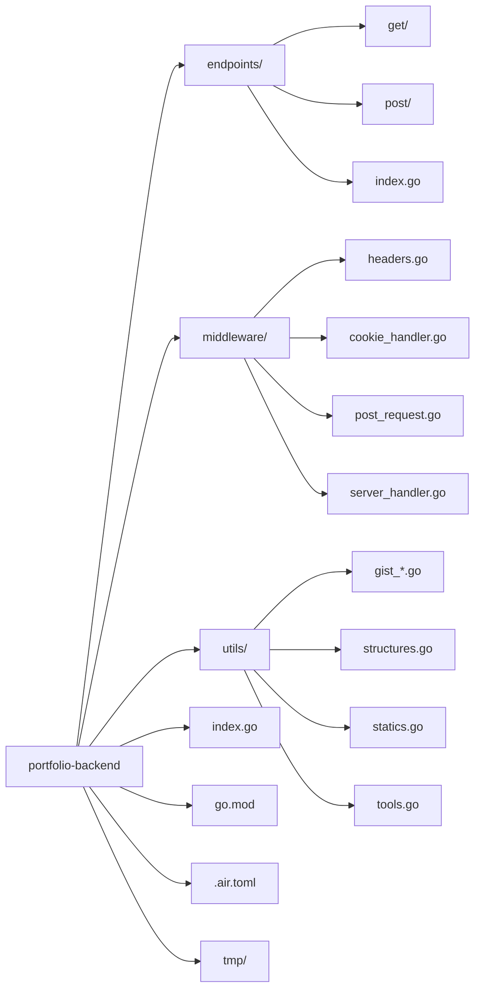

# Portfolio Backend

A comprehensive Go-based REST API backend designed to serve portfolio data through GitHub Gist integration. This backend provides endpoints for managing projects, experiences, feedback, and includes unique features like Baybayin transliteration and AI chat integration.

<div align="center">


</div>

## 🚀 Features

- **RESTful API** with clean endpoint structure
- **GitHub Gist Integration** for dynamic data management
- **Baybayin Transliterator** for Filipino script conversion
- **AI Chat Agent** powered by Pollinations AI
- **Three-tier Permission System** (ALL, COOKIE, ADMIN)
- **CORS Support** with configurable origins
- **Hot Reload Development** with Air
- **Comprehensive Logging** with request tracking
- **Environment-based Configuration** for development and production
- **Modular Architecture** with clean separation of concerns
- **Unicode Support** for Baybayin script rendering
- **Caching System** for improved performance

## 📋 Table of Contents

- [Installation](#installation)
- [Configuration](#configuration)
- [API Endpoints](#-api-endpoints)
- [Documentation](#-documentation)
- [System Architecture](#-system-architecture)
- [Development](#development)
- [Testing](#testing)
- [Deployment](#deployment)
- [Troubleshooting](#troubleshooting)
- [Changelog](#changelog)
- [Contributing](#contributing)
- [License](#license)

## 🛠 Installation

### Prerequisites

- Go 1.25.3 or higher
- Git
- GitHub Personal Access Token (for Gist integration)
- [Air](https://github.com/cosmtrek/air) for hot reload development (optional but recommended)

### Setup

1. **Clone the repository**
   ```bash
   git clone https://github.com/RyannKim327/portfolio-backend.git
   cd portfolio-backend
   ```

2. **Install dependencies**
   ```bash
   go mod download
   ```

3. **Configure environment variables**
   
   Create a `.env` file in the root directory with the following variables:
   ```bash
   # Copy and modify these values according to your setup
   APP_ENV=development
   API_KEY=your_github_personal_access_token
   GIST_ID=your_gist_id_for_data_storage
   POST_API=your_post_api_key
   TG_API=your_telegram_bot_token
   TG_CHATID=your_telegram_chat_or_channel_id
   RAPIDKEY=your_rapidapi_key
   RAPIDHOST=youtube-mp36.p.rapidapi.com
   PORT=8000
   ```

4. **Run the application**
   ```bash
   # Development mode with hot reload
   air

   # Production mode
   go run index.go
   ```

## ⚙️ Configuration

Create a `.env` file in the root directory:

```env
APP_ENV=development
API_KEY=your_github_personal_access_token
GIST_ID=your_gist_id_for_data_storage
POST_API=your_post_api_key
TG_API=your_telegram_bot_token
TG_CHATID=your_telegram_chat_or_channel_id
RAPIDKEY=your_rapidapi_key
RAPIDHOST=youtube-mp36.p.rapidapi.com
PORT=8000
```

### Environment Variables

| Variable | Description | Required |
|----------|-------------|----------|
| `APP_ENV` | Application environment (development/production) | Yes |
| `API_KEY` | GitHub Personal Access Token for Gist API | Yes |
| `GIST_ID` | GitHub Gist ID for data storage | Yes |
| `POST_API` | API key read by `X-API-Key` header for admin-only POST requests | Yes |
| `TG_API` | Telegram bot token used for `/images` proxying and `/upload` relays | Yes (for images/uploads) |
| `TG_CHATID` | Telegram chat/channel ID that receives uploaded media | Yes (for uploads) |
| `RAPIDKEY` | RapidAPI key used by `/yt` | Yes (for `/yt`) |
| `RAPIDHOST` | RapidAPI host used by `/yt` (e.g. `youtube-mp36.p.rapidapi.com`) | Yes (for `/yt`) |
| `PORT` | Server port (defaults to 8000 if unset) | No |

## 🌐 API Endpoints

### Endpoint Matrix

| Method | Path | Permission | Description | Notes |
|--------|------|------------|-------------|-------|
| GET | `/` | ALL | Health/status probe | Returns application metadata and uptime markers. |
| GET | `/projects` | ALL | Portfolio project listing | Reads from GitHub Gist; cached for 60s. |
| GET | `/experiences` | ALL | Work experience timeline | Sorted chronologically before response. |
| GET | `/certs` | ALL | Certificates listing | Reads `certificates.json` from GitHub Gist; reversed newest-first. |
| GET | `/blog` | ALL | Blog feed | Streams entire `blog.json`, newest-first. |
| GET | `/feedback` | ALL | Public feedback viewer | Supports pagination via `page` query (10/page). |
| GET | `/poetry` | ALL | Poetry collection | Mirrors the curated poetry list from Gist. |
| GET | `/baybayin` | ALL | Baybayin transliterator | Requires `text` query; returns Unicode script. |
| GET | `/images` | ALL | Telegram CDN proxy | Requires `file` (Telegram `file_id`). Note: route is defined as `images` (no leading slash) but is typically mounted as `/images`. |
| GET | `/manga` | ALL | Manga helper utility | Use `s` for search, `r` for series (slug or URL), `c` for chapter. Note: route is defined as `manga` (no leading slash) but is typically mounted as `/manga`. |
| GET | `/set-cookie` | ALL | Issues temporary cookie | Sets `temporary` cookie (30m) for cookie-protected POST access; `Secure` + `SameSite=None`. |
| GET | `/yt` | ALL | YouTube MP3 downloader helper | Requires `videoID` query (URL or ID). Uses RapidAPI (`RAPIDKEY`, `RAPIDHOST`). |
| POST | `/feedback` | COOKIE | Stores feedback via Gist | Requires `temporary` cookie + JSON body. |
| POST | `/poetry` | ADMIN | Publishes new poem entries | Requires `X-API-Key` header (matches `POST_API`). |
| POST | `/ai/chat` | ALL | Pollinations chat relay | Accepts ChatGPT-style `messages` array and returns cleaned content (ads stripped). |
| POST | `/certs` | ADMIN | Append a certificate entry | Requires `X-API-Key` header (matches `POST_API`); appends to `certificates.json` in Gist. |
| POST | `/upload` | ADMIN | Telegram upload bridge | `multipart/form-data` with `image` field; relays to `sendPhoto`. |

### Endpoint Details

#### GET /feedback
- **Pagination**: `page` query (≥ 1, default `1`).
- **Cache**: Responses cached for 5 minutes; requesting page `1` invalidates the cache first.
- **Storage**: Reads `feedback.json` from the configured GitHub Gist.

```bash
curl "http://localhost:8000/feedback?page=2"
```

#### GET /blog
- **Pagination**: `page` query (≥ 1, default `1`). Response includes `pages`, `current`, `count`, and `data`.
- **Cache**: Responses cached for 5 minutes and refreshed in the background when cache is valid.
- **Ordering**: Newest entries appear first by reversing the list in-memory.

```bash
curl "http://localhost:8000/blog?page=1"
```

#### GET /baybayin
- **Usage**: Converts Latin text to Baybayin script using Unicode glyphs and normalization.
- **Tip**: Strip punctuation on the client side for best transliteration accuracy.

```bash
curl "http://localhost:8000/baybayin?text=kumusta%20ka"
```

#### GET /manga
`GET /manga` is a multi-mode helper around a third-party manga source:
1. **Search** – `?s=<title>` to get matching series metadata.
2. **Chapter List** – `?r=<series-slug>` to enumerate chapters.
3. **Chapter Pages** – `?r=<series-slug>&c=<chapter-id>` to receive page image URLs.

#### GET /images
- **Input**: `file` query takes a Telegram `file_id` returned by `POST /upload`. 
- **Behaviour**: The backend downloads the file via Telegram Bot API and streams it to the caller, masking bot credentials.

```bash
curl "http://localhost:8000/images?file=AgACAgUAAxkBAAIBQWdow"
```

#### POST /ai/chat
- **Body**: Chat-style payload with `messages` array.
- **Timeouts**: Requests are proxied to Pollinations AI; keep payloads compact to avoid upstream limits.

```bash
curl -X POST http://localhost:8000/ai/chat \\
  -H "Content-Type: application/json" \\
  -d '{
    "messages": [
      {"role": "user", "content": "Hello, how are you?"}
    ]
  }'
```

#### POST /upload
- **Security**: Requires both `X-API-Key` header (`POST_API`) and valid Telegram env vars.
- **Response**: Forwards Telegram's JSON payload, including the generated `file_id` for re-use with `/images`.

```bash
curl -X POST http://localhost:8000/upload \\
  -H "X-API-Key: $POST_API" \\
  -F "image=@/path/to/photo.jpg"
```

## 📚 Documentation

The README doubles as the living reference, but the project ships with several complementary documentation touchpoints:

### Source-of-Truth Artifacts
- **Route metadata**: Each handler exports a `utils.Route` definition under `endpoints/get` or `endpoints/post`, making it easy to inspect path, method, and permission levels directly in code.
- **Environment reference**: `.env` (sample) plus the [Configuration](#-configuration) section lists every supported variable.
- **Middleware contracts**: `middleware/` contains concise, self-documented functions that describe headers, cookies, and permission checks.

### How to Explore the API
1. **Go Doc** – run `go doc ./...` to generate inline package documentation for handlers, middleware, and utilities.
2. **cURL/HTTP collections** – the snippets in this README can be pasted into REST clients (Hoppscotch, Thunder Client, Postman) for quick smoke tests.
3. **Ad-hoc OpenAPI** – if you maintain a `docs/openapi.yaml`, regenerate it after adding routes by iterating through the `utils.Route` list; the structure was designed with spec generation in mind.

### Keeping Docs Updated
- Update tables under [API Endpoints](#-api-endpoints) whenever a handler is added/changed.
- Keep diagrams (Mermaid) in the [System Architecture](#-system-architecture) section synchronized with actual dependencies (Gist, Telegram, Pollinations, cache).
- Mention schema or payload tweaks in the [Changelog](#changelog) so clients know when to adapt.

## 🏗 System Architecture

### System Overview
- **Gin Router**: Terminates HTTP traffic, applies CORS/default headers, and dispatches into the routing matrix declared in `endpoints/`.
- **Permission Tier**: Unified middleware enforces `ALL`, `COOKIE`, or `ADMIN` access levels before any handler executes business logic.
- **Handler Layer**: Consolidates response shaping, cache orchestration, and fan-out to third-party services such as GitHub Gist, Pollinations AI, and Telegram Bot API.
- **Caching**: Lightweight in-memory cache reduces duplicate reads from Gist for hotspots like `/projects` and `/feedback`.
- **Utility Processors**: Baybayin transliteration, manga helpers, and other local processors live in `utils/` to keep handlers thin.

### System Architecture

```mermaid
flowchart TD
    A[Client Apps<br/>(Web, Mobile, CLI)] --> B[Gin Router]
    B --> C{Permission Tier}
    C -->|ALL| D[Handlers]
    C -->|COOKIE| E[Cookie Middleware]
    C -->|ADMIN| F[Admin Middleware]
    E --> D
    F --> D
    D --> G{Cache Hit?}
    G -->|Yes| Q[JSON Response]
    G -->|No| H{Data Source}
    H -->|Portfolio & Content| I[GitHub Gist API]
    H -->|AI Chat| J[Pollinations AI]
    H -->|Media Bridge| K[Telegram Bot API]
    H -->|Local Ops| L[In-memory processors
(Baybayin, Manga, etc.)]
    I --> M[Normalizer + Cache Writer]
    J --> M
    K --> M
    L --> M
    M --> Q
    Q --> N[Client Response]
```

### Component Responsibilities

| Component | Responsibility | Notes |
|-----------|----------------|-------|
| Router (`index.go`) | Initializes Gin, mounts middleware, and registers routes | Uses `utils.Route` definitions for discoverability |
| Middleware (`middleware/`) | Handles headers, cookies, permission gating, and request logging | Central place to add observability or rate limiting |
| Handlers (`endpoints/`) | Business logic, payload binding, and response formatting | Should remain stateless apart from cache access |
| Cache Layer | Stores pre-rendered JSON for hot endpoints | TTL tuned per endpoint (e.g., 5 minutes for `/feedback`) |
| External Services | GitHub Gist for storage, Pollinations AI for chat, Telegram Bot API for uploads/images | Isolated via `utils` helpers for easier swapping |
| Utilities (`utils/`) | Shared structs, Gist helpers, Baybayin transliterator, static constants | Keeps handlers DRY and enforces consistent responses |

### Project Structure (High-level)


```mermaid
flowchart LR
    A[portfolio-backend]
    A --> B[endpoints/]
    A --> C[middleware/]
    A --> D[utils/]
    A --> E[index.go]
    A --> F[go.mod]
    A --> G[.air.toml]
    A --> H[tmp/]

    B --> B1[get/]
    B --> B2[post/]
    B --> B3[index.go]

    C --> C1[headers.go]
    C --> C2[cookie_handler.go]
    C --> C3[post_request.go]
    C --> C4[server_handler.go]

    D --> D1[gist_*.go]
    D --> D2[structures.go]
    D --> D3[statics.go]
    D --> D4[tools.go]
```

> Notes:
> - `endpoints/` contains route definitions grouped by HTTP method (`get/`, `post/`).
> - `utils/` contains Gist clients, shared structs, constants, and local processors.
> - `middleware/` enforces headers, auth tiers, and request handling concerns.

### Request Flow


```mermaid
sequenceDiagram
    participant C as Client
    participant R as Router
    participant M as Middleware
    participant H as Handler
    participant Cache as Cache Layer
    participant G as GitHub Gist
    participant T as Telegram API
    participant AI as Pollinations AI
    participant L as Local Services

    C->>R: HTTP Request
    R->>M: Route + attach metadata
    M->>H: Enforce permissions & forward
    H->>Cache: Lookup composite cache key
    alt Cache Hit
        Cache-->>H: Cached payload
    else Cache Miss
        H->>G: Fetch portfolio/feedback data
        H->>AI: Proxy chat payloads
        H->>T: Relay uploads/fetch images
        H->>L: Execute Baybayin/manga helpers
        G-->>H: JSON blobs
        AI-->>H: AI responses
        T-->>H: Telegram payloads
        L-->>H: Processed data
        H-->>Cache: Store normalized response
    end
    H->>C: JSON Response
```

## 🔧 Development

### Hot Reload Development

This project uses [Air](https://github.com/cosmtrek/air) for hot reload during development:

```bash
# Install Air (if not already installed)
go install github.com/cosmtrek/air@latest

# Start development server with hot reload
air

# The server will automatically restart when you make changes to .go files
# Build logs are saved to build-errors.log
# Temporary files are stored in the tmp/ directory
```

### Building for Production

```bash
# Build the application
go build -o portfolio-backend .

# Run the built binary
./portfolio-backend

# Or build and run in one command
go run index.go
```

### Project Structure

```
portfolio-backend/
├── endpoints/           # API endpoint definitions
│   ├── get/            # GET request handlers
│   ├── post/           # POST request handlers
│   └── index.go        # Route registration
├── middleware/         # HTTP middleware
│   ├── server_handler.go
│   ├── headers.go
│   ├── cookie_handler.go
│   └── post_request.go
├── utils/              # Utility functions
│   ├── structures.go   # Data structures
│   ├── gist_handler.go # GitHub Gist integration
│   ├── gist.go         # Additional Gist utilities
│   ├── statics.go      # Constants
│   └── tools.go        # Helper functions
├── tmp/                # Temporary files (Air)
├── .air.toml          # Air configuration
├── .env               # Environment variables
├── go.mod             # Go module definition
└── index.go           # Application entry point
```

### Adding New Endpoints

1. **Create endpoint file** in `endpoints/get/` or `endpoints/post/`
2. **Define route structure** using `utils.Route`
3. **Register route** in `endpoints/index.go`
4. **Implement handler function**

Example:
```go
// endpoints/get/example.go
package get

import (
    "portfolio-backend/utils"
    "github.com/gin-gonic/gin"
)

var Example = utils.Route{
    Path:       "/example",
    Method:     utils.METHOD_GET,
    Permission: utils.PERMISSION_ALL, // or PERMISSION_COOKIE, PERMISSION_ADMIN
    Handler: func(ctx *gin.Context) {
        ctx.JSON(200, gin.H{
            "message": "Hello World",
        })
    },
}
```

Then add it to `endpoints/index.go`:
```go
var Routes = []utils.Route{
    // ... existing routes
    get.Example, // Add your new route here
}
```

### Permission System

The application supports three permission levels:

- **`PERMISSION_ALL`**: Open access, no authentication required
- **`PERMISSION_COOKIE`**: Requires valid cookie authentication
- **`PERMISSION_ADMIN`**: Requires admin-level authentication

## 🧪 Testing

### Manual Testing

You can test the API endpoints using curl or any HTTP client:

```bash
# Test server status
curl http://localhost:8000/

# Test Baybayin transliterator
curl "http://localhost:8000/baybayin?text=kumusta ka"

# Test AI chat (POST request)
curl -X POST http://localhost:8000/ai/chat \
  -H "Content-Type: application/json" \
  -d '{"messages":[{"role":"user","content":"Hello!"}]}'

# Test feedback submission (requires cookie)
curl -X POST http://localhost:8000/feedback \
  -H "Content-Type: application/json" \
  -H "Cookie: temporary=your-temporary-cookie" \
  -d '{"name":"Test","email":"test@example.com","message":"Test message"}'
```

### Environment Testing

```bash
# Test with different environments
APP_ENV=production go run index.go
APP_ENV=development go run index.go
```

## 🚀 Deployment

### Production Deployment

1. **Build the application**
   ```bash
   go build -o portfolio-backend .
   ```

2. **Set production environment variables**
   ```bash
   export APP_ENV=production
   export API_KEY=your_production_github_token
   export GIST_ID=your_production_gist_id
   export POST_API=your_production_post_api_key
   export TG_API=your_production_telegram_bot_token
   export TG_CHATID=your_production_telegram_chat_id
   export PORT=8000
   ```

3. **Run the application**
   ```bash
   ./portfolio-backend
   ```

### Docker Deployment (Optional)

Create a `Dockerfile`:
```dockerfile
FROM golang:1.25-alpine AS builder
WORKDIR /app
COPY go.mod go.sum ./
RUN go mod download
COPY . .
RUN go build -o portfolio-backend .

FROM alpine:latest
RUN apk --no-cache add ca-certificates
WORKDIR /root/
COPY --from=builder /app/portfolio-backend .
EXPOSE 8000
CMD ["./portfolio-backend"]
```

### Environment Variables for Production

- Set `APP_ENV=production` for production optimizations
- Use secure API keys and tokens
- Configure appropriate CORS origins
- Set up proper logging and monitoring

## 🔧 Troubleshooting

### Common Issues

#### Port Already in Use
```bash
# Check what's using port 8000
lsof -i :8000

# Kill the process or change PORT in .env
export PORT=8080
```

#### GitHub API Rate Limiting
- Ensure your GitHub Personal Access Token has proper permissions
- Check rate limits: `curl -H "Authorization: token YOUR_TOKEN" https://api.github.com/rate_limit`

#### CORS Issues
- Check your CORS configuration in the middleware
- Ensure your frontend origin is allowed

#### Gist Access Issues
- Verify your `GIST_ID` is correct
- Ensure your GitHub token has gist permissions
- Check if the gist is public or private

#### Build Errors
```bash
# Clean module cache
go clean -modcache

# Reinstall dependencies
go mod download

# Verify Go version
go version
```

### Debug Mode

Enable debug logging by setting:
```bash
export APP_ENV=development
```

### Logs

- Air build logs: `build-errors.log`
- Application logs: Check console output
- Request logs: Enabled by default in development mode

## 📝 Changelog

> Current release: **v1.6.0**

### Version 1.6.0 - March 23, 2026
#### Added
- Edit blogs

#### Initiated
- Contacts to Admin based

### Version 1.5.1 - March 19, 2026

Caching

#### Added
- Caching for easy load

### Version 1.5.0 - March 18, 2026

Multimedia Update and Security

#### Change
- Endpoint `/upload-image` to `/upload`
- Endpoint `/images` to `/retrieve`
- Change `JSON` to `Abort` response in posting with admin

#### Added
- Can now upload any type of data
	- Automatically identify the file type based on its `mimetype`

### Version 1.4.2 - March 16, 2026

Parameter Update

#### Change
-	Added `data` on **experience** and **projects** for singularity responses

### Version 1.4.1 - March 14, 2026

Updates gathered from commits `1779383`, `eb34d36`, `602f7e3`, and `23f82bf`.

#### Added
- **Certificates endpoints** for listing and publishing portfolio certifications:
  - `GET /certs` (public) reading `certificates.json` from Gist.
  - `POST /certs` (admin) appending new certificate entries to Gist.
- **Blog view** improvements (`GET /blog`) and related output updates.

#### Changed
- Adjusted list sizing/tuning from **10 → 15** for paginated responses (see commit `23f82bf`).

#### Fixed
- Fixed a state/interaction issue between **clicked items and pagination** (see commit `eb34d36`).

### Version 1.4.0 - March 5, 2026

Feature + reliability release.

#### Added
- **YouTube MP3 helper endpoint** (`GET /yt`) backed by RapidAPI, returning both `url` and extracted `title`.
- **RapidAPI configuration variables** (`RAPIDKEY`, `RAPIDHOST`) documented in the setup and environment variable matrix.

#### Changed
- `POST /ai/chat` now strips Pollinations “Support/Ad” footer content from responses and includes safer parsing/validation of the upstream payload.
- `POST /blog` now auto-assigns a monotonically increasing `id` when appending new blog posts.
- Air dev config updated to stop on build errors and clear the screen on rebuild for a cleaner dev loop.

### Version 1.3.2 - February 14, 2026

Documentation-focused release.

#### Added
- Documentation section explaining where to find canonical references (routes, env vars, middleware) and how to explore the API.
- Component responsibilities matrix in the architecture chapter for quicker onboarding.

#### Changed
- API endpoint matrix now highlights permissions, data sources, and cache behaviour.
- Architecture diagrams upgraded with cache-awareness plus external integrations (GitHub Gist, Pollinations AI, Telegram API).
- README acknowledgement now mentions Qodo assistance for documentation and code review.

### Version 1.3.1 - February 12, 2026

Updates gathered from commit `5ae36f8`.

#### Added
- **Public blog endpoint** (`GET /blog`) re-registered so it is part of the router again and exposed through the API matrix.

#### Changed
- Simplified `GET /blog` handler to always return the full reversed list from `blog.json`, temporarily disabling the unfinished pagination cache to avoid stale data.
- Re-enabled localhost (`http://localhost:5173`) as an allowed origin in the CORS middleware to unblock local frontend testing sessions.

### Version 1.3.0 - February 7, 2026

Updates gathered from commits `231d625`, `886400b`, and `79880e1`.

#### Added
- **Manga utility endpoint** (`GET /manga`) that supports search, chapter listing, and inline chapter reading workflows.
- **Telegram storage bridge** with `POST /upload` for administrators and `GET /images` for public consumption, enabling offloaded asset hosting.
- **Expanded README endpoint matrix** covering required query/body parameters and usage examples for new routes.

#### Changed
- Documented the new pagination behaviour for `GET /feedback` and aligned API docs with the latest permission matrix.
- Clarified AI chat usage to match the updated `/ai/chat` path and payload structure.

### Version 1.2.0 - January 19, 2026

#### Added
- Enhanced AI chat agent with improved response formatting
- Better error handling for API requests
- Comprehensive logging system with timestamp formatting

#### Fixed
- Baybayin transliterator character mapping improvements
- CORS configuration for production deployment
- Cookie handling middleware stability

#### Changed
- Updated Go version to 1.25.0
- Improved project structure documentation
- Enhanced middleware permission system

### Version 1.1.0 - January 3, 2026

#### Added
- Three-tier permission system (ALL, COOKIE, ADMIN)
- Cookie handler middleware for secure authentication
- Admin-level endpoint protection
- Enhanced request logging and monitoring

#### Fixed
- Security improvements for POST endpoints
- Better error handling for unauthorized requests

#### Changed
- Restructured middleware architecture
- Improved endpoint registration system

### Version 1.0.0 - January 1, 2026

#### Added
- Baybayin transliterator endpoint with Unicode support
- AI chat agent integration with Pollinations AI
- Complete Filipino script character mapping
- Text normalization for accurate transliteration

#### Fixed
- Baybayin character encoding issues
- String processing for special characters
- Transliteration accuracy improvements

#### Changed
- Enhanced API response formatting
- Improved error messages for better debugging

### Version 0.9.0 - December 31, 2025

#### Added
- Initial Baybayin transliterator implementation
- Basic character mapping system
- Text processing utilities

#### Fixed
- Initial transliteration algorithm
- Character recognition patterns

### Version 0.8.0 - December 30, 2025

#### Added
- Core API structure with Gin framework
- GitHub Gist integration for data management
- Basic CORS configuration
- Environment variable support

#### Features
- RESTful API endpoints for portfolio data
- Dynamic data fetching from GitHub Gist
- Hot reload development setup with Air
- Comprehensive error handling

## 🤝 Contributing

1. Fork the repository
2. Create a feature branch (`git checkout -b feature/amazing-feature`)
3. Commit your changes (`git commit -m 'Add some amazing feature'`)
4. Push to the branch (`git push origin feature/amazing-feature`)
5. Open a Pull Request

## 📄 License

This project is licensed under the MIT License - see the [LICENSE.md](LICENSE.md) file for details.

### Additional Terms

- **Attribution**: Attribution to the original author (Ryann Kim Sesgundo) is appreciated but not required
- **GitHub Integration**: Users are responsible for complying with GitHub's Terms of Service and API usage policies
- **Data Privacy**: Users must ensure compliance with applicable data protection regulations
- **Security**: Implement appropriate security measures before deploying to production

## 👨‍💻 Author

**Ryann Kim Sesgundo (MPOP Reverse II)**
- Email: weryses19@gmail.com
- GitHub: [@RyannKim327](https://github.com/RyannKim327)
- Portfolio: [ryannkim327.is-a.dev](https://ryannkim327.is-a.dev)

## 🙏 Acknowledgments

- [Gin Web Framework](https://gin-gonic.com/) for the excellent HTTP framework
- [Air](https://github.com/cosmtrek/air) for hot reload development
- [Pollinations AI](https://pollinations.ai/) for AI chat integration
- [GitHub Gist API](https://docs.github.com/en/rest/gists) for data storage solution
- [GoDotEnv](https://github.com/joho/godotenv) for environment variable management
- [Gin CORS](https://github.com/gin-contrib/cors) for Cross-Origin Resource Sharing support
- **[Qodo Command](https://github.com/qodo-ai)** for documentation assistance and automated code review feedback

---

**Note**: This backend is designed as a centralized hub for managing deployed projects across web and mobile platforms. The API is optimized for portfolio websites and applications requiring dynamic content management.
