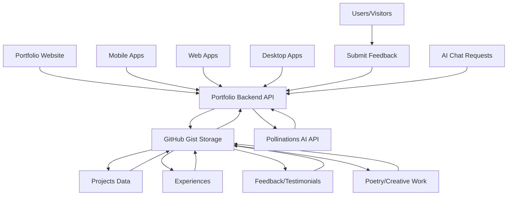

# Portfolio Backend API

> **A centralized backend service that connects all my projects to my portfolio, enabling feedback collection and serving as testimony for each application.**

## 👨‍💻 Creator

**Ryann Kim Sesgundo [MPOP Reverse II]**

## 🎯 Main Purpose

This repository serves as the **central nervous system** for my portfolio ecosystem. Its primary functions are:

- **🔗 Project Integration Hub**: Connects all my applications (web, mobile, desktop) to my portfolio
- **💬 Feedback Collection**: Gathers user feedback and testimonials for each project
- **📊 Portfolio Data Management**: Serves project information, experiences, and achievements
- **🌐 Unified API Gateway**: Provides consistent endpoints for all portfolio-related data
- **🤖 AI-Powered Interactions**: Intelligent conversational capabilities for enhanced user experience
- **🏛️ Cultural Heritage**: Baybayin transliteration service for Filipino cultural preservation

## 🏗️ What This Backend Powers

### Connected Applications & Projects

This backend serves data to and collects feedback from:

- **Portfolio Website** - Main showcase of projects and skills
- **Mobile Applications** - Various mobile projects in my portfolio
- **Web Applications** - Interactive web projects and demos
- **Desktop Applications** - Cross-platform desktop solutions

### Data Sources & Management

All data is managed through **GitHub Gist** as a lightweight, version-controlled database:

- **Projects Data** (`/projects`) - Showcase of all my applications
- **Experiences** (`/experiences`) - Professional and educational background
- **Feedback & Testimonials** (`/feedback`) - User reviews and project testimonials
- **Poetry & Creative Work** (`/poetry`) - Creative writing and artistic expressions
- **Baybayin Transliteration** (`/baybayin`) - Filipino to ancient Baybayin script conversion
- **🤖 AI Agent Integration** - Smart responses and automated interactions (enabled)

## 🚀 Live API Endpoints

| Endpoint | Method | Purpose | Response Format | Description |
|----------|--------|---------|-----------------|-------------|
| `/` | GET | Welcome | `{"message": "The server is now active"}` | API health check and welcome message |
| `/projects` | GET | Projects Showcase | `[{...}]` | List of all portfolio projects with details |
| `/experiences` | GET | Professional Background | `[{...}]` | Work experience and education history |
| `/feedback` | GET | Testimonials | `{"count": number, "data": [{...}]}` | User feedback and project testimonials (reversed order) |
| `/feedback/submit` | POST | Submit Feedback | `{"from": {...}}` | Allow users to submit feedback for projects (requires API key) |
| `/poetry` | GET | Creative Work | `{"count": number, "data": [{...}]}` | Personal poetry and creative writing (reversed order) |
| `/poetry/submit` | POST | Submit Poetry | `{"from": {...}}` | Submit new poetry entries (requires API key) |
| `/baybayin` | GET | Baybayin Transliteration | `{"original": "text", "response": "ᜊᜌ᜔ᜊᜌᜒᜈ᜔"}` | Convert Filipino/Tagalog text to Baybayin script |
| `/ai/chat` | POST | AI Integration | `{"role": "assistant", "content": "..."}` | Smart responses and automated interactions (enabled) |

### 🔄 Automatic Endpoint Transformation

The backend automatically transforms POST endpoints by adding `/submit` suffix:
- `POST /feedback` → `POST /feedback/submit`
- `POST /poetry` → `POST /poetry/submit`

This ensures clear distinction between data retrieval and data submission endpoints.

### Request/Response Examples

#### GET Endpoints
All GET endpoints return JSON data directly or in a structured format with count and data fields.

#### GET /baybayin
**Query Parameters:**
- `text` (required): The Filipino/Tagalog text to transliterate to Baybayin script

**Example Request:**
```
GET /baybayin?text=kumusta ka
```

**Response:**
```json
{
  "original": "kumusta ka",
  "response": "ᜃᜓᜋᜓᜐ᜔ᜆ ᜃ"
}
```

**Error Response (Missing text parameter):**
```json
{
  "error": "Required parameter \"text\""
}
```

#### POST /poetry/submit (Requires API Key)
**Headers:**
```
X-API-Key: your_post_api_key
```

**Request Body:**
```json
{
  "title": "My Poem",
  "content": "Beautiful verses here...",
  "author": "Ryann Kim Sesgundo",
  "date": "2024-12-24"
}
```

**Response:**
```json
{
  "from": {
    "title": "My Poem",
    "content": "Beautiful verses here...",
    "author": "Ryann Kim Sesgundo",
    "date": "2024-12-24"
  }
}
```

#### POST /feedback/submit (Requires API Key)
**Headers:**
```
X-API-Key: your_post_api_key
```

**Request Body:**
```json
{
  "project": "My Awesome App",
  "rating": 5,
  "comment": "Great application!",
  "user": "John Doe"
}
```

**Response:**
```json
{
  "from": {
    "project": "My Awesome App",
    "rating": 5,
    "comment": "Great application!",
    "user": "John Doe"
  }
}
```

#### POST /ai/chat (Enabled)
**Note:** This endpoint is now active and available for AI-powered conversations.

**Request Body:**
```json
{
  "messages": [
    {
      "role": "user",
      "content": "Hello, how are you?"
    }
  ]
}
```

**Response:**
```json
{
  "role": "assistant",
  "content": "Hello! I'm doing well, thank you for asking. How can I help you today?"
}
```

**Features:**
- Powered by Pollinations AI (OpenAI-compatible)
- Supports conversation history with multiple messages
- Markdown formatting in responses
- Temperature-controlled responses for consistency
- Maximum 1000 tokens per response

## 💡 How It Works



## 🛠️ Tech Stack

- **Backend**: Go 1.25+ with Gin Framework
- **Data Storage**: GitHub Gist API (JSON files)
- **Development**: Air (Hot reload)
- **AI Integration**: Pollinations AI API (OpenAI-compatible)
- **CORS**: Configured for cross-origin requests
- **Authentication**: GitHub Personal Access Token + API Key for POST operations
- **Deployment**: Lightweight, containerizable
- **Security**: API key validation for protected endpoints
- **Headers**: Custom developer identification headers

## 📁 Project Structure

```
portfolio-backend/
├── endpoints/              # API route handlers
│   ├── index.go           # Welcome endpoint
│   ├── projects.go        # Projects showcase endpoint
│   ├── feedback.go        # Feedback retrieval
│   ├── post_feedback.go   # Feedback submission
│   ├── experiences.go     # Professional background
│   ├── poetry.go          # Creative work retrieval
│   ├── post_poetry.go     # Poetry submission
│   ├── baybayin.go        # Baybayin transliteration service
│   ├── ai_agent.go        # AI integration (available but disabled)
│   └── routers.go         # Route registration
├── middleware/            # Server setup and security
│   ├── server_handler.go  # Server configuration and CORS
│   ├── post_request.go    # API key validation middleware
│   └── headers.go         # Custom response headers
├── utils/                 # GitHub Gist integration & utilities
│   ├── gist.go           # Gist API handlers with error handling
│   ├── gist_handler.go   # Gist data processing
│   ├── structures.go     # Data structures and types
│   └── tools.go          # Utility functions
├── .env                   # Environment configuration
├── .air.toml             # Hot reload configuration
├── go.mod                # Go module dependencies
└── index.go              # Application entry point
```

## 🚀 Quick Start

### Prerequisites
- Go 1.25+
- GitHub Personal Access Token (with Gist permissions)
- API key for protected POST endpoints

### Setup
1. **Clone the repository**
   ```bash
   git clone <repository-url>
   cd portfolio-backend
   ```

2. **Install dependencies**
   ```bash
   go mod download
   ```

3. **Configure environment**
   ```bash
   # Create .env file
   echo "APP_ENV=development" > .env
   echo "API_KEY=your_github_personal_access_token" >> .env
   echo "GIST_ID=your_gist_id" >> .env
   echo "POST_API=your_post_api_key" >> .env
   echo "PORT=8000" >> .env  # Optional: specify custom port
   ```

4. **Run the server**
   ```bash
   # Development (with hot reload)
   air
   
   # Or production
   go run index.go
   ```

The API will be available at `http://localhost:8000`

## 🔗 Integration Examples

### Frontend Integration
```javascript
// Fetch projects for portfolio display
const projects = await fetch('http://localhost:8000/projects')
  .then(res => res.json());

// Submit user feedback
await fetch('http://localhost:8000/feedback/submit', {
  method: 'POST',
  headers: { 
    'Content-Type': 'application/json',
    'X-API-Key': 'your_post_api_key'
  },
  body: JSON.stringify({
    project: 'My Awesome App',
    rating: 5,
    comment: 'Great application!',
    user: 'John Doe'
  })
});

// Transliterate text to Baybayin
const baybayinResponse = await fetch('http://localhost:8000/baybayin?text=mahal kita')
  .then(res => res.json());
console.log(baybayinResponse.response); // Output: ᜋᜑᜎ᜔ ᜃᜒᜆ

// Chat with AI agent (when enabled)
const aiResponse = await fetch('http://localhost:8000/ai/chat', {
  method: 'POST',
  headers: { 'Content-Type': 'application/json' },
  body: JSON.stringify({
    messages: [
      {
        role: 'user',
        content: 'Tell me about this portfolio'
      }
    ]
  })
}).then(res => res.json());
```

### Mobile App Integration
```dart
// Flutter/Dart example
Future<List<dynamic>> fetchProjects() async {
  final response = await http.get(
    Uri.parse('http://localhost:8000/projects')
  );
  return json.decode(response.body);
}

// Submit feedback from mobile app
Future<Map<String, dynamic>> submitFeedback(Map<String, dynamic> feedback) async {
  final response = await http.post(
    Uri.parse('http://localhost:8000/feedback/submit'),
    headers: {
      'Content-Type': 'application/json',
      'X-API-Key': 'your_post_api_key'
    },
    body: json.encode(feedback),
  );
  return json.decode(response.body);
}

// Baybayin transliteration in mobile app
Future<String> translateToBaybayin(String text) async {
  final response = await http.get(
    Uri.parse('http://localhost:8000/baybayin?text=${Uri.encodeComponent(text)}')
  );
  final data = json.decode(response.body);
  return data['response'];
}
```

## 📊 Feedback & Testimonials System

This backend enables:
- **Real-time feedback collection** from any connected application
- **Testimonial management** for portfolio credibility
- **Project-specific reviews** to showcase user satisfaction
- **Automated feedback aggregation** for portfolio statistics
- **Chronological ordering** with newest feedback first
- **Secure submission** with API key validation

## 🏛️ Baybayin Transliteration

The Baybayin endpoint (`/baybayin`) provides:
- **Filipino to Baybayin conversion** for cultural preservation
- **Text normalization** (i→e, u→o, r→d, f→p, v→b, etc.)
- **Special character handling** (ng combinations, punctuation)
- **Vowel diacritics** for proper Baybayin representation
- **Query parameter interface** for easy integration
- **Error handling** for missing parameters

### Baybayin Features:
- Converts modern Filipino/Tagalog text to ancient Baybayin script
- Handles consonant clusters and vowel modifications
- Supports punctuation marks (periods, commas, question marks)
- Normalizes modern letters to traditional Baybayin equivalents
- Preserves word spacing and sentence structure

## 🤖 AI Integration

The AI agent endpoint (`/ai/chat`) provides:
- **Conversational AI** powered by Pollinations AI
- **Markdown support** for rich text responses
- **Context-aware responses** with conversation history
- **Temperature-controlled** responses for consistency
- **Error handling** for robust API interactions
- **OpenAI-compatible** API structure
- **Pre-configured system prompts** for detailed, readable responses

## 🌟 Why This Architecture?

1. **Centralized Management**: One API to rule them all
2. **Scalable**: Easy to add new projects and endpoints
3. **Lightweight**: GitHub Gist as database keeps it simple
4. **Version Controlled**: All data changes are tracked
5. **Cost Effective**: No database hosting costs
6. **Developer Friendly**: Simple JSON-based data management
7. **AI-Enhanced**: Built-in conversational capabilities
8. **Secure**: API key protection for data modification

## 🔒 Security & Configuration

- **Environment-based API key management** for GitHub Gist access
- **CORS enabled** for cross-origin requests from `https://ryannkim327.is-a.dev`
- **Input validation** for all POST endpoints
- **Error handling** with appropriate HTTP status codes
- **Request logging** with timestamps and status codes
- **Custom 404 page** for undefined routes
- **API key validation middleware** for protected endpoints
- **Custom developer headers** for identification

### ✅ Recent Updates & Improvements

### Latest Changes (January 1, 2026)
- [x] **AI Integration Enabled** - AI chat endpoint is now active and fully functional
- [x] **Baybayin Optimization** - Improved transliteration accuracy and performance
- [x] **Code Optimization** - Removed redundant functions for better performance
- [x] **Documentation Updates** - Updated README with latest endpoint status
- [x] **Enhanced Error Handling** - Improved error handling throughout the application
- [x] **Custom Headers Middleware** - Added developer identification headers
- [x] **Code Comments** - Added comprehensive comments for better code documentation
- [x] **Structure Improvements** - Fixed naming conventions (AccessApi → AccessAPI)
- [x] **Request Validation** - Enhanced request validation and error responses
- [x] **Logging Improvements** - Better request logging with timestamps

### Core Infrastructure
- [x] **Go Backend Setup** - Complete Gin framework implementation
- [x] **GitHub Gist Integration** - Full CRUD operations with Gist API
- [x] **CORS Configuration** - Cross-origin support for web applications
- [x] **Hot Reload Development** - Air configuration for efficient development
- [x] **Environment Configuration** - Secure API key and configuration management
- [x] **Project Structure** - Clean, modular architecture with separated concerns

### API Endpoints Implementation
- [x] **Welcome Endpoint** (`GET /`) - Health check and API status
- [x] **Projects Showcase** (`GET /projects`) - Portfolio projects display
- [x] **Experiences API** (`GET /experiences`) - Professional background data
- [x] **Feedback System** (`GET /feedback`) - Testimonials retrieval with count
- [x] **Feedback Submission** (`POST /feedback/submit`) - User feedback collection
- [x] **Poetry Collection** (`GET /poetry`) - Creative work showcase with count
- [x] **Poetry Submission** (`POST /poetry/submit`) - Protected poetry creation
- [x] **Baybayin Transliteration** (`GET /baybayin`) - Filipino to Baybayin script conversion
- [x] **AI Chat Integration** (`POST /ai/chat`) - Conversational AI capabilities (disabled in router)

### Security & Authentication
- [x] **API Key Validation** - Middleware for protected POST endpoints
- [x] **Environment Security** - Secure token and key management
- [x] **CORS Security** - Configured for specific domain access
- [x] **Input Validation** - JSON binding and error handling
- [x] **Error Handling** - Comprehensive error responses with proper HTTP codes
- [x] **Custom Headers** - Developer identification in response headers

### Data Management
- [x] **Gist File Operations** - Read, write, and update operations with error handling
- [x] **Data Structures** - Type-safe Go structures for all data types
- [x] **Reverse Chronological Ordering** - Latest entries first for feedback and poetry
- [x] **Count Aggregation** - Total count tracking for collections
- [x] **JSON Processing** - Efficient data serialization and deserialization
- [x] **Error Recovery** - Robust error handling for API failures

### AI Integration
- [x] **Pollinations AI API** - Integration with OpenAI-compatible service (enabled)
- [x] **Conversation Context** - Message history support
- [x] **Markdown Support** - Rich text responses with formatting
- [x] **Temperature Control** - Consistent AI response generation
- [x] **Error Handling** - Robust API failure management
- [x] **Production Ready** - AI endpoint is now active and available for use

### Development Tools
- [x] **Git Version Control** - Complete repository setup with proper gitignore
- [x] **MIT License** - Open source licensing with additional terms
- [x] **Documentation** - Comprehensive README with examples
- [x] **Build Configuration** - Air hot reload setup
- [x] **Dependency Management** - Go modules with all required packages

## 🔮 Possible Future Enhancements

### 🚀 High Priority
- [ ] **Database Migration** - Move from GitHub Gist to PostgreSQL/MongoDB for better performance
- [ ] **Authentication System** - JWT-based user authentication for admin features
- [ ] **Rate Limiting** - API rate limiting for production deployment
- [ ] **Caching Layer** - Redis integration for improved response times
- [ ] **API Versioning** - Version management for backward compatibility
- [ ] **Health Monitoring** - Comprehensive health checks and monitoring endpoints

### 📊 Analytics & Insights
- [ ] **Analytics Dashboard** - Web interface for feedback and usage insights
- [ ] **Real-time Notifications** - WebSocket support for live feedback notifications
- [ ] **Usage Statistics** - API endpoint usage tracking and analytics
- [ ] **Feedback Analytics** - Sentiment analysis and rating aggregation
- [ ] **Performance Metrics** - Response time and throughput monitoring
- [ ] **User Behavior Tracking** - Anonymous usage pattern analysis

### 🔍 Advanced Features
- [ ] **Advanced Search** - Full-text search across projects, feedback, and poetry
- [ ] **Content Filtering** - Advanced filtering and sorting capabilities
- [ ] **Bulk Operations** - Batch import/export functionality
- [ ] **Data Validation** - Enhanced input validation and sanitization
- [ ] **Content Moderation** - Automated content filtering for feedback
- [ ] **Backup System** - Automated data backup and recovery

### 🌐 Integration & Connectivity
- [ ] **Webhook Support** - Real-time updates to connected applications
- [ ] **Third-party Integrations** - Slack, Discord, email notifications
- [ ] **Social Media Integration** - Auto-posting to social platforms
- [ ] **Portfolio Platform APIs** - Integration with LinkedIn, GitHub, etc.
- [ ] **Mobile Push Notifications** - Real-time mobile app notifications
- [ ] **Email Service** - Automated email responses and notifications

### 🏛️ Cultural & Educational Features
- [ ] **Enhanced Baybayin Support** - Additional Philippine scripts (Buhid, Hanunoo, Tagbanwa)
- [ ] **Historical Context** - Educational content about Baybayin history
- [ ] **Interactive Learning** - Baybayin learning modules and exercises
- [ ] **Cultural Documentation** - Integration with Philippine cultural databases
- [ ] **Multi-dialect Support** - Support for various Filipino regional languages
- [ ] **Baybayin Font Generation** - Custom font creation for Baybayin text

### 🤖 AI & Machine Learning
- [ ] **Enhanced AI Capabilities** - Multiple AI model support
- [ ] **Conversation Memory** - Persistent conversation context
- [ ] **AI Content Generation** - Automated project descriptions
- [ ] **Sentiment Analysis** - Feedback sentiment classification
- [ ] **Recommendation Engine** - Project recommendation based on user interests
- [ ] **Natural Language Processing** - Advanced text analysis and insights
- [ ] **AI-Powered Baybayin** - Machine learning for improved transliteration accuracy
- [ ] **Cultural AI Assistant** - AI specialized in Filipino culture and history

### 🔒 Security & Compliance
- [ ] **OAuth Integration** - Google, GitHub, LinkedIn authentication
- [ ] **GDPR Compliance** - Data protection and privacy features
- [ ] **Audit Logging** - Comprehensive activity logging
- [ ] **Data Encryption** - End-to-end encryption for sensitive data
- [ ] **Security Scanning** - Automated vulnerability assessment
- [ ] **Access Control** - Role-based permissions system

## 🐛 Error Handling

The API includes comprehensive error handling:
- **400 Bad Request**: Invalid JSON or missing required fields
- **403 Forbidden**: Invalid or missing API key for protected endpoints
- **404 Not Found**: Custom HTML page for undefined routes
- **500 Internal Server Error**: Server-side errors with descriptive messages

## 📈 Development Timeline

### Phase 1: Foundation (Completed)
- ✅ Basic Go backend setup with Gin framework
- ✅ GitHub Gist integration for data storage
- ✅ CORS configuration for web access
- ✅ Basic CRUD operations for all data types

### Phase 2: Core Features (Completed)
- ✅ All GET endpoints for data retrieval
- ✅ POST endpoints for feedback and poetry submission
- ✅ AI integration with Pollinations API
- ✅ Security middleware for protected endpoints

### Phase 3: Enhancement (Completed)
- ✅ Error handling and validation
- ✅ Data counting and reverse ordering
- ✅ Hot reload development setup
- ✅ Comprehensive documentation

### Phase 4: Cultural Features (Completed)
- ✅ Baybayin transliteration system implementation
- ✅ Filipino text normalization and processing
- ✅ Cultural heritage preservation features
- ✅ Enhanced error handling throughout the application

### Phase 5: Recent Improvements (Completed)
- ✅ Custom headers middleware for developer identification
- ✅ Improved code documentation with comments
- ✅ Structure improvements and naming conventions
- ✅ Better request validation and logging

### Phase 6: Future Development (Planned)
- 🔄 Database migration and performance optimization
- 🔄 Advanced security and authentication
- 🔄 Analytics and monitoring capabilities
- 🔄 Extended AI features and integrations

## 📋 Changelog

### [v2.2.0] - 2026-01-01
#### 🤖 AI Integration Enhancement
- **Enabled**: AI chat endpoint (`/ai/chat`) is now active and available
- **Updated**: AI integration status in documentation
- **Enhanced**: AI agent functionality for production use
- **Improved**: AI response handling and error management

### [v2.1.0] - 2026-01-01
#### 🏛️ Cultural Features & Optimizations
- **Added**: Baybayin transliteration endpoint (`/baybayin`)
- **Added**: Filipino text normalization (i→e, u→o, r→d, f→p, v→b, etc.)
- **Added**: Special character handling for ng combinations
- **Added**: Vowel diacritics support for proper Baybayin representation
- **Removed**: Redundant string normalization function for optimization
- **Fixed**: Baybayin transliterator accuracy and performance
- **Improved**: Transliteration process efficiency
- **Enhanced**: Cultural heritage preservation features

### [v2.0.0] - 2025-12-27
#### 🔧 Infrastructure & Error Handling
- **Added**: Custom redirect error handling
- **Improved**: Error response consistency across all endpoints
- **Enhanced**: Request validation and error messages

### [v1.9.0] - 2025-12-24
#### 📚 Documentation & Code Quality
- **Updated**: Comprehensive README documentation
- **Added**: Detailed code comments throughout the application
- **Improved**: Error handling mechanisms
- **Enhanced**: Code structure and organization
- **Added**: Developer identification headers

### [v1.8.0] - 2025-12-23
#### 🤖 AI Integration & Structure Improvements
- **Added**: Pollinations AI integration for chat functionality
- **Added**: AI agent endpoint (`/ai/chat`) with OpenAI-compatible API
- **Added**: Markdown support in AI responses
- **Improved**: Code structure separation (utils, endpoints, middleware)
- **Fixed**: POST method access and validation
- **Enhanced**: Request/response handling
- **Updated**: README with comprehensive API documentation

### [v1.7.0] - 2025-12-22
#### 📊 Data Management Enhancements
- **Added**: Total count tracking for feedback collections
- **Added**: GET request support for feedback retrieval
- **Improved**: Data aggregation and response formatting
- **Enhanced**: Feedback system with chronological ordering

### [v1.6.0] - 2025-12-21
#### 🌐 CORS & Experiences
- **Added**: CORS configuration for cross-origin requests
- **Added**: Experiences endpoint for professional background data
- **Added**: `experiences.json` data structure
- **Fixed**: Cross-origin access issues
- **Improved**: Server configuration and middleware setup

### [v1.5.0] - 2025-12-20
#### 🔧 Configuration & Deployment
- **Added**: Environment-based PORT configuration
- **Added**: PORT manager for flexible deployment
- **Fixed**: Auto import from API functionality
- **Improved**: POST method handling for Gist operations
- **Enhanced**: Environment variable management

### [v1.4.0] - 2025-12-19
#### 🚀 Deployment Optimization
- **Removed**: Vercel configuration files
- **Deleted**: `uptime.go` file for cleaner structure
- **Improved**: Deployment configuration
- **Optimized**: Server startup and configuration

### [v1.3.0] - 2025-12-18
#### 🔐 Security & Monitoring
- **Added**: POST request functionality with API key validation
- **Added**: Case-insensitive request handling
- **Added**: Request logging and monitoring
- **Enhanced**: Security middleware implementation
- **Improved**: Request validation and error handling

### [v1.2.0] - 2025-12-17
#### 📁 Data Integration
- **Added**: Projects endpoint with Gist data integration
- **Added**: Dynamic project showcase functionality
- **Fixed**: Initial Gist API integration issues
- **Improved**: Data retrieval and processing

### [v1.1.0] - 2025-12-15
#### 🏗️ Core Infrastructure
- **Added**: GitHub Gist integration for data storage
- **Added**: Environment configuration with `.env` support
- **Added**: Utility functions for API access
- **Added**: Custom 404 error handling
- **Improved**: Server structure and middleware organization
- **Enhanced**: Route registration system

### [v1.0.0] - 2025-12-15
#### 🎉 Initial Release
- **Added**: Basic Go backend with Gin framework
- **Added**: Hot reload development setup with Air
- **Added**: Modular endpoint structure
- **Added**: Route registration system
- **Added**: Basic server configuration
- **Added**: Initial project structure and dependencies

---

### 🏷️ Version Naming Convention
- **Major versions** (x.0.0): Significant architectural changes or breaking changes
- **Minor versions** (x.y.0): New features, endpoints, or major enhancements
- **Patch versions** (x.y.z): Bug fixes, optimizations, and minor improvements

### 📝 Changelog Categories
- **Added**: New features, endpoints, or functionality
- **Changed**: Changes in existing functionality
- **Deprecated**: Soon-to-be removed features
- **Removed**: Removed features or files
- **Fixed**: Bug fixes and error corrections
- **Security**: Security-related improvements
- **Improved**: Performance or code quality enhancements
- **Enhanced**: User experience or functionality improvements

## 📞 Contact & Feedback

**Ryann Kim Sesgundo**
- 📧 Email: weryses19@gmail.com
- 🔗 [GitHub](https://github.com/RyannKim327)
- 💼 [LinkedIn](https://www.linkedin.com/in/ryannkim327/)

---

## 🎯 Project Milestones

- **🎉 December 15, 2025**: Initial project creation and basic server setup
- **🔗 December 17, 2025**: GitHub Gist integration for data management
- **🔐 December 18, 2025**: Security implementation with API key validation
- **🌐 December 21, 2025**: CORS configuration and experiences endpoint
- **📊 December 22, 2025**: Feedback system with count aggregation
- **🤖 December 23, 2025**: AI integration with Pollinations API
- **📚 December 24, 2025**: Comprehensive documentation and code comments
- **🏛️ December 31, 2025**: Baybayin transliteration system implementation
- **✨ January 1, 2026**: Cultural heritage features optimization and AI integration enablement

---

⭐ **This backend is the foundation that makes my entire portfolio ecosystem possible!**

*Want to see it in action? Check out my portfolio website and other connected applications to see how this API powers the entire experience.*
